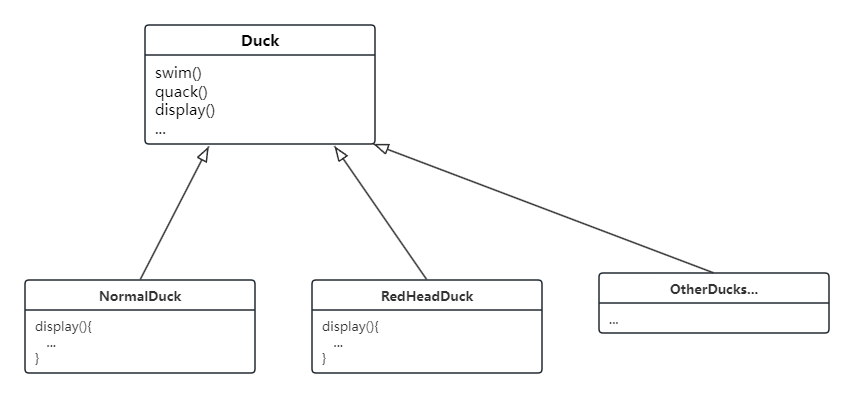
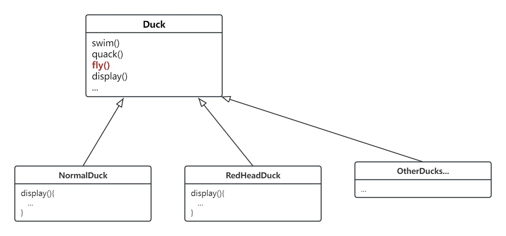
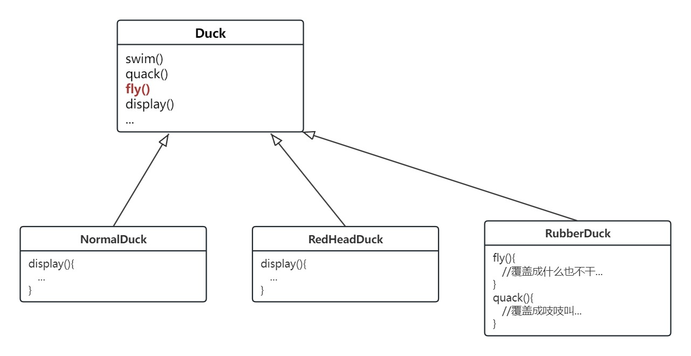
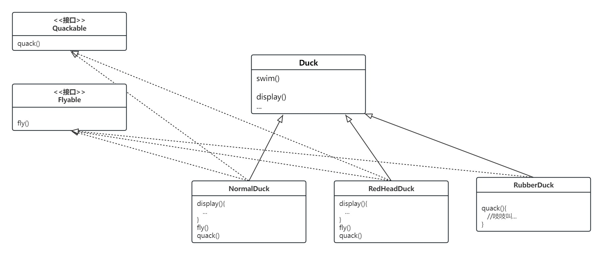
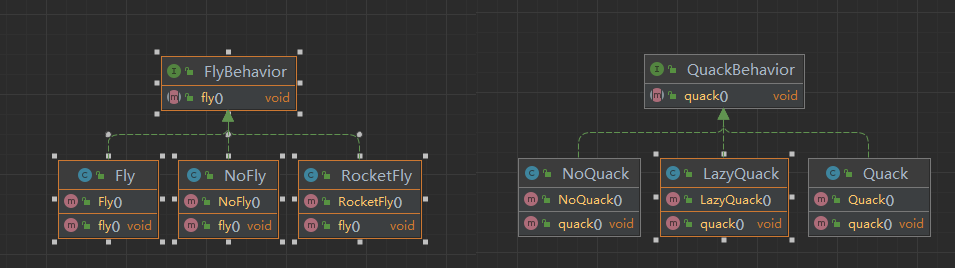
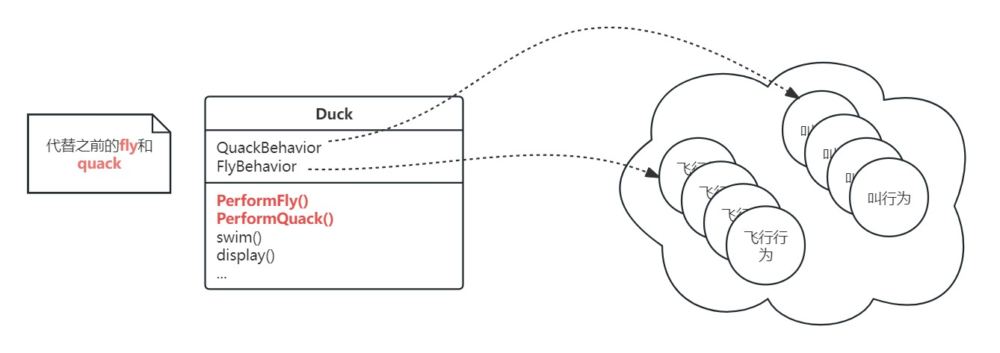

# 设计模式浅析(一) ·策略模式

## 日常叨逼叨

java设计模式浅析，如果觉得对你有帮助，记得一键三连，谢谢各位观众老爷😁😁


---

## 案例介绍

### 问题提出

在了解设计模式之前呢,我们先来简单的通过一个小案例:

​	假如你是一个程序设计师,现在在设计一个关于鸭子的小游戏,小游戏中有各种各样的鸭子,一边游泳戏水,一边呱呱叫等;这个游戏内部使用了标准的OO技术,你设计设计了一个鸭子的超类,并让各种各样的鸭子继承超类.



​	但是经过领导们开会商议后需要加一下鸭子会飞这一功能,于是,你在之前的基础上加上了鸭子会飞这个功能



但是这一加,却出现了问题,老板找到你,就这种情况下,说想加一个橡皮鸭子,但是橡皮鸭子不会飞,也不会嘎嘎叫,要求你改代码,于是你改成了下面这个样子:



没过几天,老板又让你加一些鸭子,什么诱饵鸭(不会飞也不会叫),模型鸭(会飞不会叫)......你按照之前橡皮鸭子的方法覆盖了子类的方法,改了两个,你就不想改了,你觉得这可能不是个好的设计方案.于是你想到了继承,于是你按照理解设计了又一套的方案:



对于你设计的这个方案,老板给出了以下的评价:

> 这真是一个超笨的主意，你没发现这么一来重复的代码会变多吗?如果你认为覆盖几个方法就算是差劲，那么对于48个Duck的子类都要稿微修改一下飞行的行为，你又怎么说?!

然后 你人傻了...

那么除了上述的方案之外,真的在没有其他好的方案了吗?

### 问题探讨

> 在上述的例子中:我们知道使用继承并不能很好地解决问题，因为鸭子的行为在子类里不断地改变，并且让所有的子类都有这些行为是不恰当的。Flyable与Quackable接口一开始似乎还挺不错，解决了问题(只有会飞的鸭子才继承Flyable)，但是Java接口不具有实现代码，所以继承接口无法达到代码的复用。这意味着:无论何时你需要修改某个行为，你必须得往下追踪并在每一个定义此行为的类中修改它，一不小心，可能会造成新的错误!

然而幸运的,在设计程序的时候,我们得遵循一个原则:

> 找出应用中可能需要变化之处，把它们独立出来，不要和那些不需要变化的代码混在一起。

下面是这个原则的另一种思考方式:

“把会变化的部分取出并封装起来，以便以后可以轻易地改动或扩充此部分，而不影响不需要变化的其他部分”。

这样的概念很简单，几乎是每个设计模式背后的精神所在。

所有的模式都提供了一套方法让“系统中的某部分改变不会影响其他部分”

好，该是把鸭子的行为从Duck类中取出的时候了!

### 问题解决

从哪里开始呢?

就我们目前所知，除了fly()和quack()的问题之外，Duck类还算一切正常，似乎没有特别需要经常变化或修改的地方。所以，除了某些小改变之外，我们不打算对Duck类做太多处理。

现在，为了要分开“变化和不会变化的部分”，我们准备建立两组类(完全远离Duck类)，将**quack**和**fly**这两个行为完全的独立出来.每一组类将实现各自的动作。比方说，我们可能有一个类实现“呱呱叫”，另一个类实现“吱吱叫”，还有一个类实现“安静”.






那么我们直接来聚合一下:

首先是一个鸭子的超类

```java
public class Duck {
    QuackBehavior quackBehavior;
    FlyBehavior flyBehavior;

    public Duck() {
    }

    public void swim() {
        System.out.println("swim");
    }

    public void display() {
        System.out.println("display");
    }

    public void PerformQuack() {
        quackBehavior.quack();
    }

    public void PerformFly() {
        flyBehavior.fly();
    }

}

```

然后是两个行为抽象出来的接口,FlyBehavior和QuackBehavior

```java
/**
 * @version 1.0
 * @Author jerryLau
 * @Date 2024/2/1 13:53
 * @注释 定义 飞 这一属性的接口
 */
public interface FlyBehavior {
    //定义飞这一行为
    public void fly();
}

```

```java
/**
 * @version 1.0
 * @Author jerryLau
 * @Date 2024/2/1 13:55
 * @注释 定义 叫这一行为的接口
 */
public interface QuackBehavior {
    public void quack();
}
```

其次是两个行为接口的实现类

```java
//正常飞
public class Fly implements FlyBehavior {
    @Override
    public void fly() {
        System.out.println("normal fly");
    }
}
//不会飞
public class NoFly implements FlyBehavior {
    @Override
    public void fly() {
        System.out.println("can't fly");
    }
}
```

```java
//正常叫
public class Quack implements QuackBehavior {
    @Override
    public void quack() {
        System.out.println("normal quack");
    }
}
//不会叫
public class NoQuack implements QuackBehavior {
    @Override
    public void quack() {
        System.out.println("no quack");
    }
}
```

最后呢 如果想创建一个普通鸭子，我们只需要在Duck同包名下创建NormalDuck

```java
public class ModelDuck extends Duck {
    public ModelDuck() {
        flyBehavior = new Fly();
        quackBehavior = new Quack();
    }

    @Override
    public void display() {
        System.out.println("Model display");
    }
}
```

我们创建主类进行测试一下

```java
public class MainDuck {
    public static void main(String[] args) {
        Duck modelDuck = new ModelDuck();
        modelDuck.PerformFly();
        modelDuck.PerformQuack();

    }
}


//运行结果
normal fly
normal quack

Process finished with exit code 0
```

此外还可以在运行时将鸭子的行为进行动态的设置，而非简单的放到构造方法的初始化中，可以在Duck超类中设置set方法，实现动态设置行为

```java
//duck.java
public  class Duck {
    QuackBehavior quackBehavior;
    FlyBehavior flyBehavior;

    public Duck() {
    }

    public void swim() {
        System.out.println("swim");
    }

    public void display() {
        System.out.println("display");
    }

    public void PerformQuack() {
        quackBehavior.quack();
    }

    public void PerformFly() {
        flyBehavior.fly();
    }

    public void setQuackBehavior(QuackBehavior quackBehavior) {
        this.quackBehavior = quackBehavior;
    }

    public void setFlyBehavior(FlyBehavior flyBehavior) {
        this.flyBehavior = flyBehavior;
    }
}

//初始化一个模型鸭子
public class ModelDuck extends Duck {
    public ModelDuck() {
        flyBehavior = new Fly(); //注意这里设置的是普通的会飞和会叫
        quackBehavior = new Quack();
    }

    @Override
    public void display() {
        System.out.println("Model display");
    }
}

//实现一种运行推进器飞行的鸭子
public class RocketFly implements FlyBehavior {
    @Override
    public void fly() {
        System.out.println("fly with rocket");
    }
}

//设置测试类让模型鸭子使用推进器飞
public class MainDuck {
    public static void main(String[] args) {
        Duck modelDuck = new ModelDuck();
        System.out.println("设置之前");
        modelDuck.PerformFly();
        modelDuck.PerformQuack();

        modelDuck.setFlyBehavior(new RocketFly());
        modelDuck.setQuackBehavior(new NoQuack());
        System.out.println("设置之后");
        modelDuck.PerformFly();
        modelDuck.PerformQuack();


    }
}

//执行结果
设置之前
normal fly
normal quack
设置之后
fly with rocket
no quack

Process finished with exit code 0

```

至此呢上面描述中遇到的问题迎刃而解，老板让加多少只不同的鸭子都不是问题了。

那么到这儿为止，你已经使用了策略模式了，没错是策略模式

## 策略模式

我们将上述案例继续进行一个简单的抽象，将鸭子的飞行**Fly**和叫**Quack**这两种行为抽象成为一些算法组，那么对于鸭子来说，算法代表着不同的鸭子能做的不同的事情（不同的飞行方式或者不同的叫的方式等）

那么策略模式的正式定义：

**策略模式**定义了算法族，分别封装起来，让它们之间可以互相替换，此模式让算法的变化独立于使用算法的客户。

在 Java 中，你可以使用接口和类来实现策略模式。例如，你可以创建一个 `Strategy` 接口，其中包含一个 `execute()` 方法。然后，你可以创建多个实现该接口的类，每个类都有自己的 `execute()` 方法实现。然后，你可以将 `Strategy` 类型的对象传递给需要它的客户端代码。

java代码的简单示例：

```java
// 定义一个策略接口  
public interface Strategy {  
    void execute();  
}  
  
// 定义具体策略类  
public class ConcreteStrategyA implements Strategy {  
    @Override  
    public void execute() {  
        System.out.println("ConcreteStrategyA 执行");  
    }  
}  
  
public class ConcreteStrategyB implements Strategy {  
    @Override  
    public void execute() {  
        System.out.println("ConcreteStrategyB 执行");  
    }  
}  
  
// 客户端类，使用策略对象  
public class Client {  
    private Strategy strategy;  
      
    // 设置策略对象  
    public void setStrategy(Strategy strategy) {  
        this.strategy = strategy;  
    }  
      
    // 执行策略方法  
    public void executeStrategy() {  
        strategy.execute();  
    }  
}
```

然后你可以在客户端代码中进行策略的调用

```java
public class Main {  
    public static void main(String[] args) {  
        Client client = new Client();  
        client.setStrategy(new ConcreteStrategyA()); // 设置使用 ConcreteStrategyA 策略  
        client.executeStrategy(); // 执行策略方法，输出 "ConcreteStrategyA 执行"  
        client.setStrategy(new ConcreteStrategyB()); // 设置使用 ConcreteStrategyB 策略  
        client.executeStrategy(); // 执行策略方法，输出 "ConcreteStrategyB 执行"  
    }  
}
```


## 总结

策略模式的主要优点是：

1. 提供了管理相关的算法族的办法。策略模式提供了对这类算法进行分类的方式，使得算法之间可以独立变化。
2. 客户端对实现一无所知。客户端在不知道具体实现类的情况下使用策略，系统结构变得简单明了。
3. 符合开闭原则。通过创建新策略类，我们可以很容易地添加新的策略，而无需修改现有代码。

然而，它也有一些缺点：

1. 客户端必须理解所有策略类，以便选择合适的策略。这违反了封装的原则，因为客户端需要知道策略的具体实现。
2. 在运行时切换策略可能会引起性能开销，因为系统需要创建新的对象实例。


代码相关代码可以参考 **[代码仓库🌐](https://gitee.com/jerrylau213/DesignPatterns)**