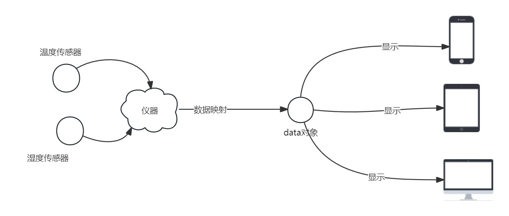
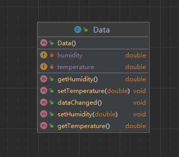
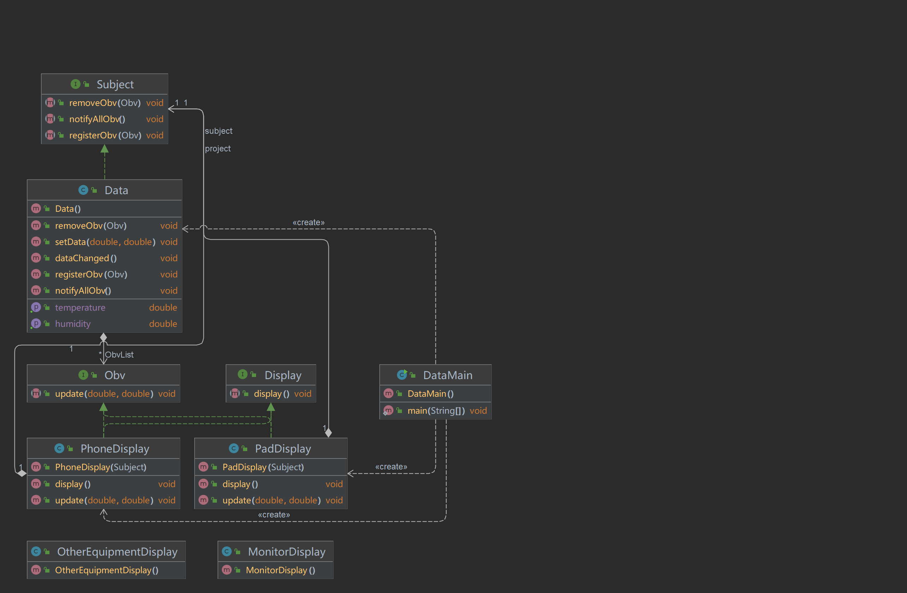

# 设计模式浅析(二) ·观察者模式

## 日常叨逼叨

java设计模式浅析，如果觉得对你有帮助，记得一键三连，谢谢各位观众老爷😁😁


---

## 案例介绍

假设存在下面这个场景：

> 你有一个监测空气湿度和温度的仪器，在该仪器获取到数值之后，你需要获取到一些数值，然后分别显示在一些显示设备（手机，平板，手环 巴拉巴拉巴拉 无所谓了）上。



> 然后呢，硬件设备的开发人员告诉你，这个`data`对象呢类图如下，其中包含两个变量，温度和适度，然后呢还有一些对应的`get/set`方法，此外还有一个方法`dataChanged`,说是在这些数值发生变化的时候，会进行调用。



那么 我们根据硬件设备开发人员的提示,在`dataChanged()`方法中完成了以下的代码

```java
 public void dataChanged() {
     //默认Data在初始化过程中，通过set方法将温度，湿度等设置好了
        //do something when data changed
        double temperature1 = getTemperature();
        double humidity1 = getHumidity();
        
        Phone.update(temperature1,humidity1);
        Pad.update(temperature1,humidity1);
     	Monitor.update(temperature1,humidity1);
    }
```

但是对于所有的设备来说都存在update方法，有点公共的意思在里面，而且在后面如果增加设备或者删除设备时，会进行比较大量的改动，不是一个较好的设计方案。

既然是浅析观察者模式，那我们尝试使用观察者模式来进行上述方案的优化

## 观察者模式

在了解观察者模式之前，我们先来了解一下关于报纸的订阅，就订阅报纸这一行为来说，有以下几个特点：

> 1-向某家报社订阅报纸，只要他们有新报纸出版，就会给你送来。只要你是他们的订户，你就会一直收到新报纸。
> 2-当你不想再看报纸的时候，取消订阅，他们就不会再送新报纸来。
> 3-只要报社还在运营，就会一直有人(或单位)向他们订阅报纸或取消订阅报纸。

而观察者模式也是如此，**观察者模式=出版社+订阅者**

如果你了解报纸的订阅是怎么回事，其实就知道观察者模式是怎么回事，只是名称不太一样:出版者改称为“主题”(`Subject`)，订阅者改称为“观察者”(`Observer`)

#### 问题解决

对于上述问题，仪器收集到数据可以类比为主题，而一些展示设备可以类比为观察者，只要仪器产生的数据发生变化，设备上的数据也会发生变化，除非该设备没有订阅该主题，而观察者可以订阅主题，也可以取消订阅。

那么我们首先可以设计一个主题的接口

```java
public interface Subject {

    //订阅
    public void registerObv(Observer obv);

    //退订
    public void removeObv(Observer obv);

    //通知
    public void notifyAllObv();
    
}
```

然后我们的数据实现这个主题接口

```java
public class Data implements Subject {
    private double temperature;//温度
    private double humidity;//湿度

    private List<Observer> ObvList;

    public Data() {
        ObvList = new ArrayList<>();
    }

    public double getTemperature() {
        return temperature;
    }


    public double getHumidity() {
        return humidity;
    }

    public void setData(double temperature, double humidity) {
        this.temperature = temperature;
        this.humidity = humidity;
        dataChanged();
    }


    public void dataChanged() {
        //do something when data changed
        notifyAllObv();
    }


    @Override
    public void registerObv(Observer obv) {
        ObvList.add(obv);
    }

    @Override
    public void removeObv(Observer obv) {
        ObvList.remove(obv);
    }

    @Override
    public void notifyAllObv() {
        for (Observer obv : ObvList) {
            obv.update(temperature, humidity);
        }
    }
}
```

对于观察者们，我们同样设置一个观察者（`Observer`）的接口和一个显示（`display`）的接口

```java
public interface Observer {
    public void update(double temp, double humidity);
}
```

```java
public interface Display {
    public void display();
}
```

创建一个手机显示，显示温度和湿度

```java
public class PhoneDisplay implements Observer, Display {
    private double temp;
    private double humidity;
    private Subject project;

    public PhoneDisplay(Subject project) {
        this.project = project;
        project.registerObv(this);
    }

    @Override
    public void display() {
        System.out.println("温度：" + temp + "湿度：" + humidity);

    }

    @Override
    public void update(double temp, double humidity) {
        this.temp = temp;
        this.humidity = humidity;
        this.display();
    }
}
```

创建主类进行测试

```java
public class DataMain {
    public static void main(String[] args) {
        Data data = new Data();
        PhoneDisplay phone = new PhoneDisplay(data);
        PadDisplay pad = new PadDisplay(data);

        data.setData(1,2);
        data.setData(2,3);
        //pad取消订阅
        data.removeObv(pad);
        data.setData(2,3);
        data.setData(4,3);

    }
}

//运行结果
手机显示【温度：1.0湿度：2.0】
pad 显示：温度【1.0】
手机显示【温度：2.0湿度：3.0】
pad 显示：温度【2.0】
手机显示【温度：2.0湿度：3.0】
手机显示【温度：4.0湿度：3.0】

Process finished with exit code 0

```

至此，我们实现了一种对于上述案例的解决方案。



除了自定义订阅者之外，还可以使用java.util中的`Observable`和`Observer`进行实现，但是`Observable`是一个“类”而非接口，你必须设计一个类继承它。如果某类想同时具有`Observable`类和另一个超类的行为，就会陷入两难，毕竟Java不支持多重继承这限制Observable的复用潜力(而增加复用潜力不正是我们使用模式最原始的动机吗?)。
再者，因为没有`Observable`接口，所以你无法建立自己的实现，和Java内置的Observer API搭配使用，也无法将java.util的实现换成另一套做法的实现


## 总结

观察者模式的优点：

1. 降低耦合性：观察者模式将主题（`Subject`）和观察者（`Observer`）之间的依赖关系解耦，使得它们可以独立地改变。主题不需要知道哪些观察者正在观察它，观察者也不需要知道主题的细节。
2. 易于扩展：由于观察者模式是松散耦合的，因此可以很容易地添加或删除观察者，而不会影响主题或其他观察者。这使得代码更加灵活，易于扩展。
3. 实现了开放/封闭原则：观察者模式遵循开放/封闭原则，即对于扩展是开放的，对于修改是封闭的。这意味着可以通过添加新的观察者来扩展系统的功能，而不必更改现有代码。
4. 实现了可重用性：观察者模式将主题和观察者分离，使它们可以独立地进行测试和重用。
5. 提高了灵活性和可维护性：观察者模式使得系统中的对象之间的通信变得更加灵活和可维护。它还使代码更易于理解和维护。

观察者模式的缺点：

1. 内存泄漏：在观察者模式中，观察者需要注册到主题对象，当观察者不再需要时，需要从主题中注销，否则会导致内存泄漏。因为如果观察者对象没有被注销，则主题对象将保留对它的引用，这将防止观察者被垃圾回收。
2. 性能问题：观察者模式在一些情况下可能会导致性能问题。当主题对象有大量观察者时，每当主题状态发生变化时，所有观察者都会被通知，这可能会导致性能问题。
3. 并发问题：如果多个线程同时访问主题对象，并且主题对象在处理一个观察者时状态发生了变化，则可能会导致并发问题。因此，在使用观察者模式时需要小心处理并发问题。
4. 对象的生命周期问题：观察者模式中的主题对象和观察者对象之间可能存在生命周期的问题。如果观察者对象在主题对象的生命周期内保持活动状态，这可能会导致一些不必要的问题。

---

代码相关代码可以参考 **[代码仓库🌐](https://gitee.com/jerrylau213/DesignPatterns)**

**ps：本文原创，转载请注明出处**

---