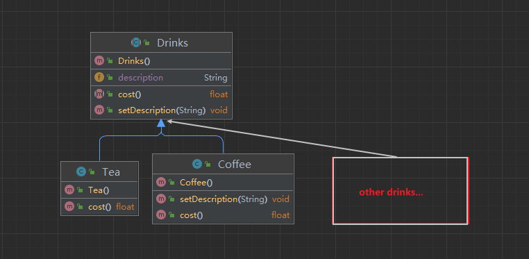
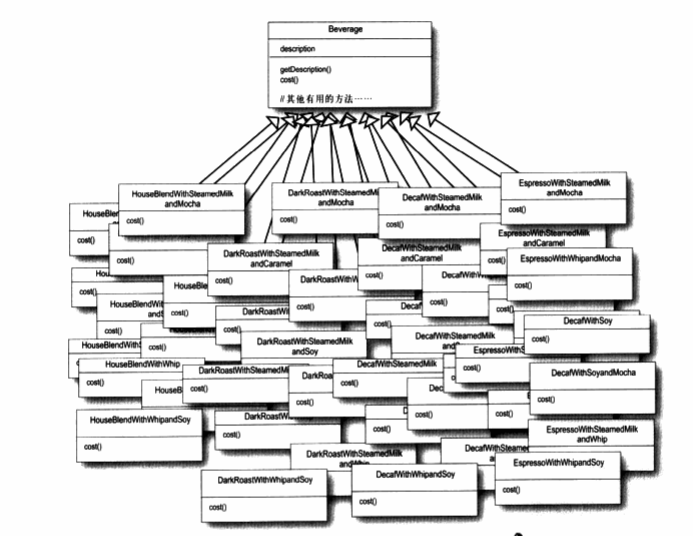

# 设计模式浅析(三) ·装饰者模式

## 日常叨逼叨

java设计模式浅析，如果觉得对你有帮助，记得一键三连，谢谢各位观众老爷😁😁


---

halo各位小伙伴们，今天我们一起来了解一下装饰者模式，首先还是先进入下面的案例，话不多说，我们开始吧！

## 案例介绍

> 蜜雪**是规模比较大的连锁饮品店，因为分店开的越来越多，扩张速度越来越快，他们准备更新订单系统，以合乎他们的饮料供应要求。
>
> 他们原先的类设计是这样的……



> 但是在购买饮品时，有些顾客会加一些配料，什么奶盖，布丁，椰果，巧克力等等，而蜜雪**呢也会根据配料的不同计算价格，所以
>
> 订单必须得考虑到这些配料的价格等。

这是他们的第一次尝试...



每个cost都得计算出奶茶+订单上所有的配料的价格，很明显这是个噩梦一样的存在。。。

这时候有一个人提出了为什么不用一些变量进行相关配料的约束呢? 那么我们根据他的思路进行程序的改造，下面是新的程序以及类图

```java
public class Drinks {
    public String description;
    public boolean Milk = false;
    public boolean Pudding = false;
    public boolean MilkCaps = false;
    public boolean Coconut = false;
    //...other ingredient

    public float cost() {
        if (hasMilk() || hasMilkCaps()) {
            return 1;
        } else if (hasCoconut()) {
            return 2;
        } else if (hasPudding()) {
            return 3;
        }
        return 0;
    }

    public void setDescription(String description) {
        this.description = description;
    }

    public String getDescription() {
        return description;
    }


    public boolean hasMilk() {
        return Milk;
    }

    public boolean hasPudding() {
        return Pudding;
    }

    public boolean hasMilkCaps() {
        return MilkCaps;
    }

    public boolean hasCoconut() {
        return Coconut;
    }

    public void setHasMilk(boolean hasMilk) {
        this.Milk = hasMilk;
    }

    public void setHasPudding(boolean hasPudding) {
        this.Pudding = hasPudding;
    }

    public void setHasMilkCaps(boolean hasMilkCaps) {
        this.MilkCaps = hasMilkCaps;
    }

    public void setHasCoconut(boolean hasCoconut) {
        this.Coconut = hasCoconut;
    }
    //other set options...
}

//coffee with milk-cup
public class Coffee extends Drinks {

    @Override
    public void setDescription(String description) {
        super.setDescription(description);
    }

    @Override
    public float cost() {
        return super.cost()+3;
    }
}

//test main

public class Main {
    public static void main(String[] args) {
        Drinks coffee = new Coffee();
        coffee.setDescription("coffee with milk-cup");
        coffee.setHasMilkCaps(true);
        System.out.println("商品："+coffee.getDescription() + " 价格："+coffee.cost());

    }
}

//运行结果
商品：coffee with milk-cup 价格：4.0

Process finished with exit code 0
```


但是仔细思考之后呢，又会发现这个模式好像也不是很合理

> 1- 调料价钱的改变会使我们更改现有代码。
>
> 2- 一旦出现新的调料，我们就需要加上新的方法，并改变超类中的cost()方法
>
> 3- 以后可能会开发出新饮料，对这些饮料而言(例如:茶)，某些调料可能并不适合，但是在这个设计方式中，Tea(茶)子类仍将继承那些不适合的方法，例如:hasMilkCaps()(加奶盖)。
>
> 4- 万一顾客想要双杯奶盖咖啡，怎么办

好了，我们已经了解利用继承无法完全解决问题，在蜜雪**遇到的问题有:

类数量爆炸、设计死板，以及基类加入的新功能并不适用于所有的子类。

所以，在这里要采用不一样的做法:

我们要以饮料为主体，然后在运行时以配料进行`装饰`饮料。比方说，如果顾客想要奶盖巧克力咖啡时，那么，要做的是:

- 拿一个coffee对象
- 用milk-cup进行装饰
- 用chocolate进行装饰
- 调用cost()方法，然后使用委托（）将两种配料的价格加到待支付价格上去

但是关于如何`装饰`一个对象呢？而`委托`又该如何实现？ 继续往下看

我们以奶盖巧克力咖啡为例子一步一步的进行

- 以Coffee类为例子，Coffee继承自Drinks，要实现cost方法.


- 顾客想要奶盖(MilkCup)，所以建立一个MilkCup对象，并用它将Coffee对象包(wrap)起来.


> MilkCup对象是一个装饰者，它的类型“反映”了它所装饰的对象(本例中，就是指的就是Coffee).
>
> 所谓的“反映"指的就是类型一致。
>
> 所以MilkCup也有一个cost()方法。通过多态也可以把MilkCup所包裹的任何Drinks当成是
>
> Drinks(因为MilkCup是Drinks的子类）

- 顾客想要巧克力(Chocolate)，所以建立一个Chocolate对象，并用它将MilkCup对象包(wrap)起来。


Chocolate是一个装饰者，所以它也反映了Coffee类型，并包括一个cost()方法。

所以，被MilkCup和Chocolate包起来的Coffee对象仍然是一个Drinks，仍然可以具有Coffee的一切行为包括调用它的cost()方法

- 首先调用最外圈装饰者Chocolate的cost方法
- 最外圈装饰者Chocolate在调用MilkCup的cost方法
- MilkCup调用Coffee的cost方法
- Coffee返回自己的价格5.0
- 通过MilkCup装饰器获取到Coffee的价格加上自己的价格返回6.0
- 最外圈装饰者Chocolate获取到MilkCup-Coffee的价格加上自己的价格返回8.0


**好了，这是目前所知道的一切**

1. 装饰者和被装饰对象有相同的超类型。
2. 你可以用一个或多个装饰者包装一个对象。
3. 既然装饰者和被装饰对象有相同的超类型，所以在任何需要原始对象(被包装的)的场合，可以用装饰过的对象代替它。
4. **装饰者可以在所委托被装饰者的行为之前与/或之后，加上自己的行为，以达到特定的目的。**（关键点!）
5. 对象可以在任何时候被装饰，所以可以在运行时动态地、不限量地用你喜欢的装饰者来装饰对象。

现在，就来看看装饰者模式的定义，并写一些代码，了解它到底是怎么工作的。

## 装饰者模式

### 概念

**装饰者模式**动态地将责任附加到对象上。若要扩展功能，装饰者提供了比继承更有弹性的替代方案。

### 基本组成

1. **抽象组件（Component）**：定义一个接口，这个接口/抽象类规定了要执行的基本操作。
2. **具体组件（ConcreteComponent）**：实现抽象组件接口的具体类/抽象类的具体实现。
3. **装饰器（Decorator）**：这是一个抽象类，它实现了与抽象组件相同的接口。它存储一个对具体组件对象的引用，并可以调用这个对象的方法。
4. **具体装饰器（ConcreteDecorator）**：这是装饰器接口的具体实现。它们在实现装饰器接口的同时，还可以增加新的功能。

### 类图


尝试让我们的蜜雪**也符合上述的设计模式

可以将Drink类抽象为**抽象组件（Component）**，两个（先演示两个，多的也很类似）具体组件Tea、Coffee为**具体组件（ConcreteComponent）**表示两种饮品，然后我们初始化一个配料的抽象类IngredientDecorator作为装饰器，再将奶盖，巧克力作为具体的配料装饰器.


那么我们将上述的设计转化为代码

```java

public abstract class Drinks {
    public String description;

    public abstract float cost();

    public String getDescription() {
        return description;
    }
    //other set options...
}

```

```java
//咖啡饮品
public class Coffee extends Drinks {

    public Coffee() {
        description = "coffee";
    }

    @Override
    public float cost() {
        return 5;
    }
}
```

```java
//配料装饰器
public abstract class IngredientDecorator extends Drinks {

    public abstract String getDescription();
}

//具体配料装饰器Chocolate
public class Chocolate extends IngredientDecorator {
    Drinks drinks;

    public Chocolate(Drinks drinks) {
        this.drinks = drinks;
    }

    @Override
    public float cost() {
        return 2 + drinks.cost();
    }

    @Override
    public String getDescription() {
        return drinks.getDescription() + " with Chocolate";
    }
}

//具体配料装饰器MilkCup
public class MilkCup extends IngredientDecorator {
    Drinks drinks;

    public MilkCup(Drinks drinks) {
        this.drinks = drinks;
    }

    @Override
    public float cost() {
        return 1 + drinks.cost();
    }

    @Override
    public String getDescription() {
        return drinks.getDescription() + " with milkcup";
    }
}
```

我们创建测试类 ，实现一杯奶盖巧克力咖啡

```java
public class Main {
    public static void main(String[] args) {
        Drinks coffee2 = new Coffee();
        coffee2 = new MilkCup(coffee2);
        coffee2 = new Chocolate(coffee2);
        System.out.println(coffee2.getDescription() + ":" + coffee2.cost());


    }
}

//运行结果
coffee with milkcup with Chocolate:8.0

Process finished with exit code 
```

拓展点：

​	java源码中的装饰者模式： **Java I/O**

#### 优缺点

Java装饰器模式的优点主要包括：

1. 动态扩展性：装饰器模式可以在运行时动态地给对象添加新的行为，而无需修改原有的代码。这使得程序更加灵活和可扩展。
2. 结构清晰：装饰器模式遵循开闭原则，即对扩展开放、对修改封闭。这意味着我们可以在不改变现有代码的情况下，通过添加新的装饰器来扩展系统功能。这有助于保持软件结构的清晰和稳定。
3. 易于维护：通过使用装饰器模式，可以将多个装饰器串联起来，从而以一种更灵活的方式组合对象的行为。这种组合方式使得代码更加模块化，易于理解和维护。

然而，装饰器模式也存在一些缺点：

1. 增加复杂度：使用装饰器模式会增加代码的复杂度和理解难度，需要仔细考虑类之间的关系和功能的组合方式。这可能会对开发人员造成一定的负担。
2. 处理顺序：装饰器模式的调用顺序可能会影响最终的结果。当一个对象被多个装饰器装饰时，需要考虑这些装饰器的执行顺序。错误的顺序可能会导致不正确的行为。
3. 运行时开销：装饰器模式需要在运行时动态创建对象，可能会导致一定的运行时开销。这在处理大量对象时可能会影响性能。


---

代码相关代码可以参考 **[代码仓库🌐](https://gitee.com/jerrylau213/DesignPatterns)**

**ps：本文原创，转载请注明出处**

---