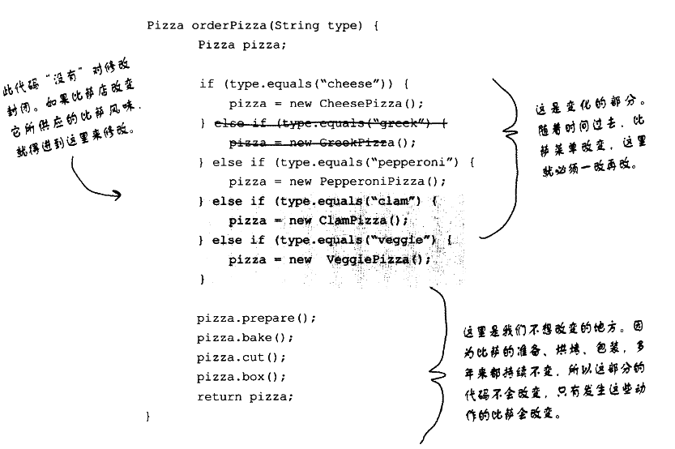
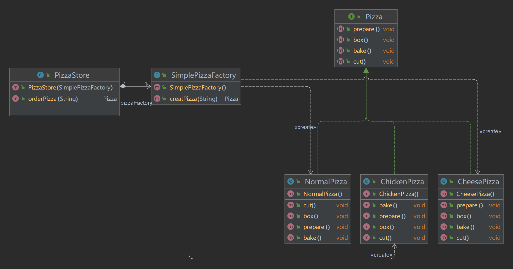
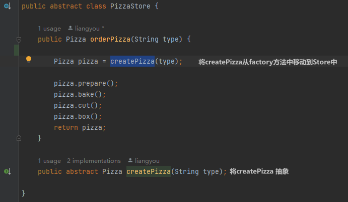
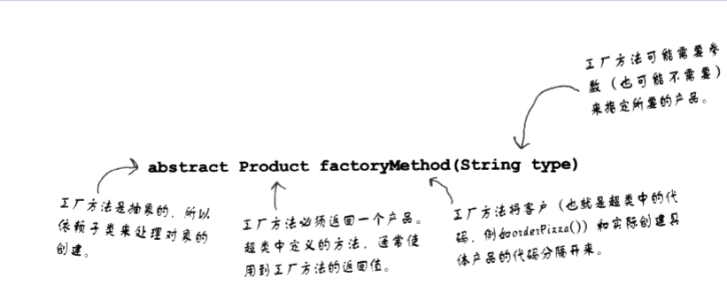
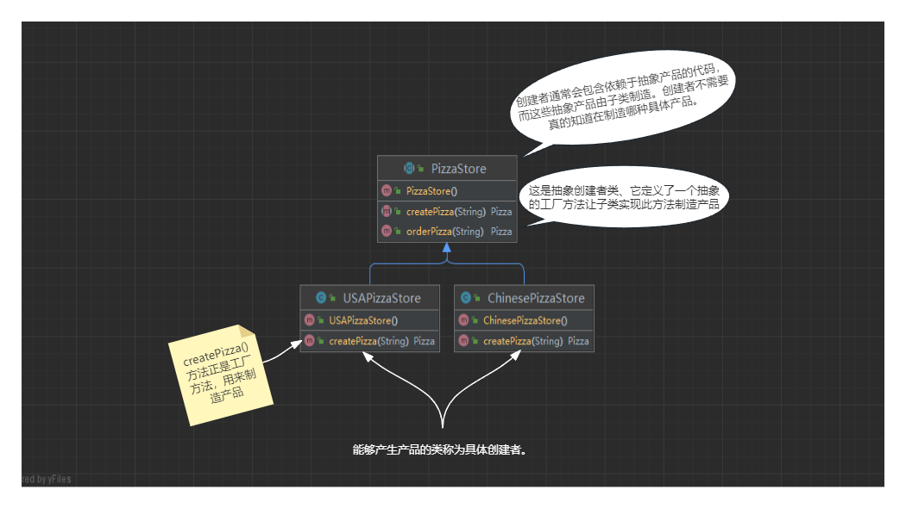
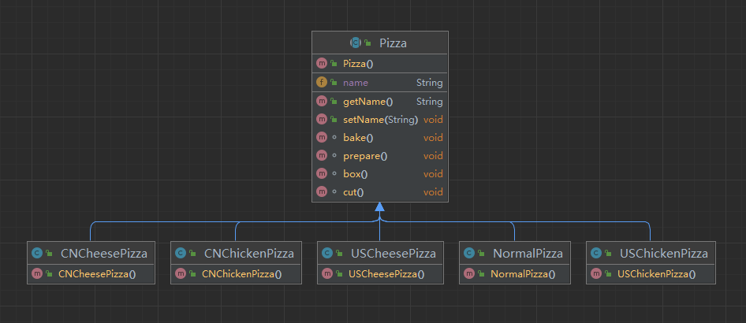
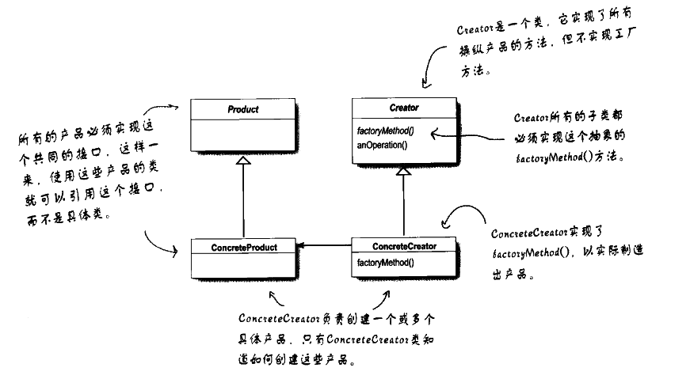

# 设计模式浅析(四) ·工厂模式

## 日常叨逼叨

观众老爷们 新春吉祥🎇🎇🎇

java设计模式浅析，如果觉得对你有帮助，记得一键三连，谢谢各位观众老爷😁😁


---

## 一、简单工厂模式

### 案例介绍

> 身为对象村最先进的pizza店店长，老Jerry带你们做pizza 
>
> 那么老Jerry的代码可能这么写

```java
 public Pizza orderPizza() {
        Pizza pizza =new Pizza() ;
        pizza.prepare();
        pizza.bake();
        pizza.cut();
        pizza.box();
        return pizza;
    }
```

> 但是老Jerry的pizza店可能有好多种类的pizza于是 代码可能会被改成以下的方式

```java
    public Pizza orderPizza(String type) {
        Pizza pizza = new NormalPizza();
        if (type == "cheese") {
            return new CheesePizza();
        } else if (type=="chicken") {
            return new ChickenPizza();
        }
        //other pizza
        
        pizza.prepare();
        pizza.bake();
        pizza.cut();
        pizza.box();
        return pizza;
    }
```

> 老Jerry发现所有的竞争者都已经在他们的菜单中加入了一些流行风味的比萨:Clam Pizza(蛤蜊比萨)、Veggie Pizza(素食比萨)。
>
> 很明显，我必须要赶上他们，所以也要把这些风味加进我的菜单中。而最近Greek Pizza(希腊比萨)卖得不好所以你决定将它从菜单中去掉；



很明显地，如果实例化“某些”具体类，将使orderPizza()出问题，而且也无法让orderPizza()对修改关闭;但是，现在我们已经知道哪些会改

变，哪些不会改变，该是使用封装的时候了。

将变化的部分抽取出去，抽象成为一个pizza工厂（SimplePizzaFactory），一旦抽象出去后，orderPizza相当于是客户端，需要什么样的

pizza,便交给工厂（SimplePizzaFactory）去创建一个什么样的pizza即可，即orderPizza只需要得到一个pizza,而这个pizza实现了抽象的

pizza接口，所以它可以调用准备，烘烤等方法。

那么代码将会变成这个样子：

- 首先创建一个关于Pizza的简单工厂

```java
public class SimplePizzaFactory {

    public Pizza creatPizza(String type) {
        Pizza pizza = new NormalPizza();
        if (type == "cheese") {
            return new CheesePizza();
        } else if (type=="chicken") {
            return new ChickenPizza();
        }
        //other pizza

        return pizza;
    }
}
```

- 重做pizzaStore类

```java
public  class PizzaStore {
    SimplePizzaFactory pizzaFactory;

    public PizzaStore(SimplePizzaFactory pizzaFactory) {
        this.pizzaFactory = pizzaFactory;
    }

    public Pizza orderPizza(String type) {
        Pizza pizza = pizzaFactory.creatPizza(type);

        pizza.prepare();
        pizza.bake();
        pizza.cut();
        pizza.box();
        return pizza;
    }
}
```

看起来好像只是把创建对象的权力给到了`SimplePizzaFactory`，没有什么其他操作，但是就是这个`SimplePizzaFactory`工厂类，已经将`PizzaStore`类和 `Pizza`对象解耦了，`PizzaStore`不再需要管具体产品对象是如何创建的，只需要负责自己的事情就可以了，明确了各自的职责和权利，有利于整个软件体系结构的优化

当然另一方面又产生了新的耦合，`PizzaStore`对象和`SimplePizzaFactory`工厂对象的耦合，工厂对象和商品对象的耦合。

后期如果再加新品种的咖啡，我们势必要需求修改`SimplePizzaFactory`的代码，违反了开闭原则。

### 定义简单工厂

> 简单工厂其实不是一个设计模式，反而比较像是一种编程习惯，但经常被使用。
>
> 有些开发人员的确是把这个编程习惯误认为是“工厂模式”(Factory Pattern)。当你下次和另一个开发人员之间无话可说的时候，这应当是打破沉默的一个不错的话题。
>
> 不要因为简单工厂不是一个“真正的”模式，就忽略了它的用法。让我们来看看新的pizza店类图:



### 简单工厂模式的优缺点

**优点：**

1）**封装了创建对象的过程，可以通过参数直接获取对象**。把对象的创建和业务逻辑层分开，这样以后就避免了修改客户代码，如果要实现新产品直接修改工厂类，而不需要在原代码中修改，这样就降低了客户代码修改的可能性，更加容易扩展。

2）**工厂类根据外界给定的信息,决定究竟应该创建哪个具体类的对象.通过使用工厂类**,**外界**可以从直接创建具体产品对象的尴尬局面摆脱出来,**仅仅需要负责“消费”对象就可以了**。**而不必管这些对象究竟如何创建及如何组织的**．明确了各自的职责和权利，有利于整个软件体系结构的优化。

**缺点：** 当系统中的具体产品类不断增多时候，可能会出现要求工厂类根据不同条件创建不同实例的需求．这种对条件的判断和对具体产品类型的判断交错在一起，**很难避免模块功能的蔓延**，对系统的维护和扩展非常不利，**违背了“开闭原则”**。

## 二、工厂方法模式

> 对象村最先进的pizza店店长生意好的不得了，然后有许多人想加盟老Jerry的pizza店，
>
> 身为加盟公司经营者，你希望确保加盟店营运的质量，所以希望这些店都使用你那些经过时间考验的代码。
>
> 然后老Jerry 想让加盟的pizza店都沿用自己禁得起考验的代码，好让pizza的流程一成不变，于是有了以下的一些想法：
>
> 如果利用`SimplePizzaFactory`，写出两种不同的工厂，分别是`APizzaFactory`,`BPizzaFactory`，那么各地加盟店都有适合的
>
> 工厂可以使用，这是一种做法。
>
> 让我们来看看会变成什么样子……

```java
APizzaFactory aFactory=new APizzaFactory(); //这里创建的工厂，是制造A风味的比萨。
PizzaStore aStore=new PizzaStore(aFactory); //然后建立一个比萨店，将A工厂的引用作为参数。
aStore.orderPizza("cheese"); //当我们制造比萨，全得到A风味的比萨
```

> 但是在推广上述的`SimpleFactory`时，你又想多添加一些质量上的控制...
>
> 在推广`SimpleFactory`时，你发现加盟店的确是采用你的工厂创建比萨，但是其他部分，却开始采用他们自创的流程:烘烤的做法有些差异、不要切片、使用其他厂商的盒子。
>
> 再想想这个问题，你真的希望能够建立一个框架，把加盟店和创建比萨捆绑在一起的同时又保持一定的弹性。
>
> 在我们稍早的`SimplePizzaFactory`代码之前，制作比萨的代码绑在`PizzaStore`里，但这么做却没有弹性。那么，该如何做才能够吃掉比萨又保有比萨呢?

> 有个做法可让比萨制作活动局限于`PizzaStore`类，而同时又能让这些加盟店依然可以自由地制作该区域的风味。
>
> 所要做的事情，就是把`createPizza()`方法放回到`PizzaStore`中，不过要把它设置成“抽象方法”，然后为每个区域风味创建一个`PizzaStore`的子类。



开加盟店有它的好处，可以从`PizzaStore`免费取得所有的功能。区域店只需要继承`PizzaStore`，然后提供`createPizza()`方法实现自己的比萨风味即可。


如果加盟店为顾客提供中国风味的比萨，就使用`ChinesePizzaStore`,因为此类的`createPizza()`方法会建立中国风味的比萨。

这里是中国风味的pizza:

```java
public class ChinesePizzaStore extends PizzaStore {
    @Override
    public Pizza createPizza(String type) {
        Pizza pizza = new NormalPizza();
        if (type == "cheese") {
            return new CNCheesePizza();
        } else if (type=="chicken") {
            return new CNChickenPizza();
        }
        //other cn pizza
        return pizza;
    }
}
```

上述超类中`createPizza()`方法中实例化pizza的职责被移动到了一个方法中，此方法就如同是一个“工厂”，工厂方法用来处理对象的创建，并将这样的行为封装在子类中。这样，客户程序中关于超类的代码就和子类对象创建代码解耦了。



所有工厂模式都用来**封装对象的创建**。工厂方法模式(FactoryMethodPattern)通过让子类决定该创建的对象是什么，来达到将对象创建的过程封装的目的。让我们来看看这些类图，以了解有哪些组成元素:

**创建者类：**



**产品类：**

这些是具体的产品，所有店里能实际制造的比萨都在这里



### 定义工厂方法模式

**工厂方法模式**定义了一个创建对象的接口，但由子类决定要实例化的类是哪一个。工厂方法让类把实例化推迟到子类。

工厂方法模式能够封装具体类型的实例化。看看下面的类图，抽象的Creator提供了一个创建对象的方法的接口，也称为“工厂方法”。在抽象的Creator中，任何其他实现的方法，都可能使用到这个工厂方法所制造出来的产品，但只有子类真正实现这个工厂方法并创建产品。

如同在正式定义中所说的，常常听到其他开发人员说:工厂方法让子类决定要实例化的类是哪一个。希望不要理解错误，所谓的“决定”，并不是指模式允许子类本身在运行时做决定，而是指在编写创建者类时，不需要知道实际创建的产品是哪一个。选择了使用哪个子类，自然就决定了实际创建的产品是什么。



### 工厂方法模式优缺点

#### 优点

- 用户只需要知道具体工厂的名称就可得到所要的产品，无须知道产品的具体创建过程。
- 灵活性增强，对于新产品的创建，只需多写一个相应的具体工厂类。无须对原工厂进行任何修改，满足开闭原则
- 典型的解耦框架。高层模块只需要知道产品的抽象类，无须关心其他实现类，满足迪米特法则、依赖倒置原则和里氏替换原则。

#### 缺点

- 类的个数容易过多，增加复杂度
- 增加了系统的抽象性和理解难度

## 三、抽象工厂模式

> 回到上文中的pizza店，在经过加盟之后，各个加盟店将遵循你的流程，但是有一些加盟店，使用低价原料来增加利润。你必须采取一些手段，以免长此以往毁了对象村的品牌。
>
> 为了确保原料的一致
>
> 你打算建造一家生产原料的工厂，并将原料运送到各家加盟店。对于这个做法，现在还剩下了一个问题:由于加盟店座落在不同的区域，所以在一些原料上存在一定的差异，原料的口味也存在这一定的偏差等等。

于是你想到了，可以建造不同口味原料的工厂，用来提供一些原料供不同加盟店使用：

首先可以定义一个工厂的接口：

```java
public interface materialFactory {

    Cheese createCheese();//奶酪

    Butter createButter();//黄油

    Chicken createChicken();//鸡肉

    Veggies[] createVeggies();//蔬菜

}
```

将某个工厂进行接口的实现，具体生产一些原料：

```java
public class ChinesePizzaFactory implements materialFactory {
    @Override
    public Cheese createCheese() {
        return new Cheese();
    }

    @Override
    public Butter createButter() {
        return new Butter();
    }

    @Override
    public Chicken createChicken() {
        return new Chicken();
    }

    @Override
    public Veggies[] createVeggies() {
        Veggies veggies[] = {new Ve_lettuce(), new Ve_onion(), new Ve_mushroom()
        };
        return veggies;
    }
}
```

重做pizza，让其使用工厂产生的原料:

```java
public abstract class Pizza {
    public String name;

    //每个比萨都持有一组在准备时会用到的原料。
    public Butter butter;
    public Cheese cheese;
    public Chicken chicken;
    public Veggies[] veggies;

    //现在把pqepare()方法声明成抽象。在这个方法中，我们需要收集比萨所需的原料，而这些原料是来自原科工厂。
    protected abstract void prepare();


    void bake() {
        System.out.println("bake");
    }


    void cut() {
        System.out.println("cut");
    }

    void box() {
        System.out.println("box");
    }

    public void setName(String name) {
        this.name = name;
    }

    public String getName() {
        return name;
    }

    @Override
    public String toString() {
        return "Pizza{" +
                "name='" + name + '\'' +
                ", butter=" + butter +
                ", cheese=" + cheese +
                ", chicken=" + chicken +
                ", veggies=" + veggies +
                '}';
    }
}
```

现在已经有了一个抽象比萨，可以开始创建中国风味的比萨

```java
public class CNCheeseChickenPizza extends Pizza {
    //每个pizza持有一个pizza工厂
    ChinesePizzaFactory chinesePizzaFactory;

    public CNCheeseChickenPizza(ChinesePizzaFactory chinesePizzaFactory) {
        this.chinesePizzaFactory = chinesePizzaFactory;
    }


    @Override
    protected void prepare() {
        //每个pizza需要何种原料的时候，像pizza工厂进行索取
        butter = chinesePizzaFactory.createButter();
        cheese = chinesePizzaFactory.createCheese();
        chicken = chinesePizzaFactory.createChicken();
        veggies= chinesePizzaFactory.createVeggies();
    }
}
```

那么在上述一连串的代码中我们做了什么呢？

>
> 我们引入新类型的工厂，也就是所谓的抽象工厂，来创建比萨原料家族。
>
> 通过抽象工厂所提供的接口可以创建产品的家族，利用这个接口书写代码，我们的代码将从实际工厂解耦，以便在不同上下文中实现各式各样的工厂，制造出各种不同的产品例如:不同的区域、不同的操作系统、不同的外观及操作。
>
> 因为代码从实际的产品中解耦了，所以我们可以替换不同的工厂来取得不同的行为(例如取得奶油而不是黄油等)。

### 定义抽象工厂模式

**抽象工厂模式**提供一个接口，用于创建相关或依赖对象的家族，而不需要明确指定具体类。

#### 优缺点

抽象工厂模式除了具有工厂方法模式的优点外，其他主要优点如下。

- 可以在类的内部对产品族中相关联的多等级产品共同管理，而不必专门引入多个新的类来进行管理。
- 当需要产品族时，抽象工厂可以保证客户端始终只使用同一个产品的产品组。
- 抽象工厂增强了程序的可扩展性，当增加一个新的产品族时，不需要修改原代码，满足开闭原则。

其缺点是：当产品族中需要增加一个新的产品时，所有的工厂类都需要进行修改。增加了系统的抽象性和理解难度。

使用抽象工厂模式一般要满足以下条件。

- 系统中有多个产品族，每个具体工厂创建同一族但属于不同等级结构的产品。
- 系统一次只可能消费其中某一族产品，即同族的产品一起使用。


---

代码相关代码可以参考 **[代码仓库🌐](https://gitee.com/jerrylau213/DesignPatterns)**

**ps：本文原创，转载请注明出处**

---