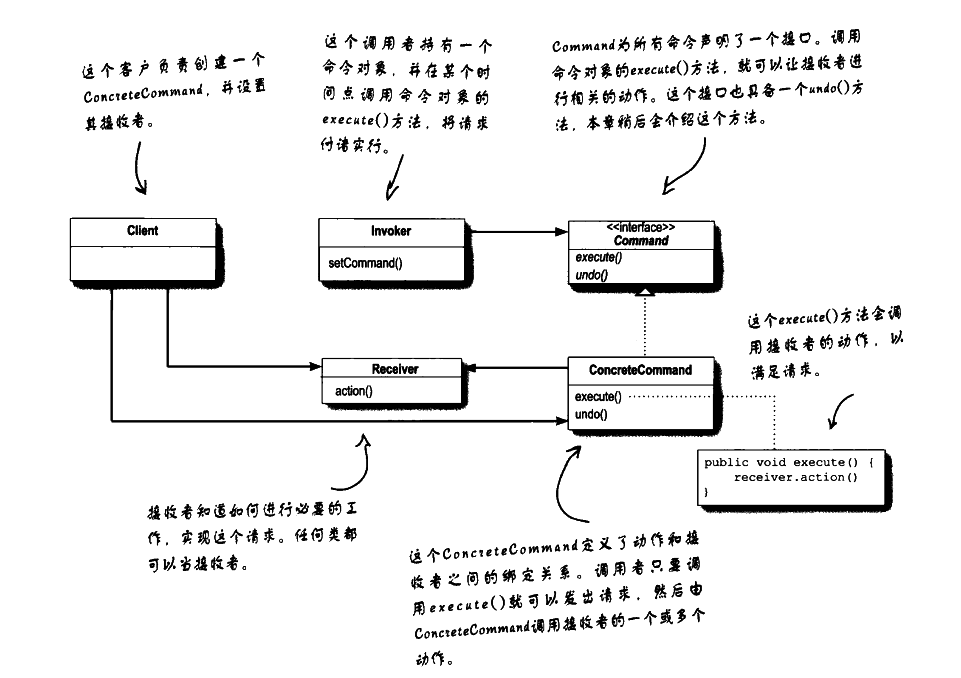

# 设计模式浅析(六) ·命令模式

## 日常叨逼叨

java设计模式浅析，如果觉得对你有帮助，记得一键三连，谢谢各位观众老爷😁😁


---


## 命令模式

#### 概念

**命令模式**（Command Pattern）是一种行为设计模式，它允许将请求封装为一个对象，从而使你可以使用不同的请求将客户端与接收者解耦。命令模式也支持可撤销操作。

#### 命令模式结构

命令模式（Command Pattern）的结构包含以下四个主要角色：

1. **Command**（命令接口）
   - 定义了一个用于执行请求的接口。命令对象通常会持有接收者对象，并在调用时执行其上的操作。
2. **ConcreteCommand**（具体命令类）
   - 实现了命令接口，通常会持有一个接收者对象，并定义了一个`execute`方法来执行请求。
   - 具体命令类知道如何执行与接收者相关联的动作，通常动作实现在接收者对象中，但命令对象决定了何时执行动作。
3. **Receiver**（接收者）
   - 知道如何执行与命令相关联的具体操作。任何类都可能成为接收者，只要它能实现执行请求所需的操作。
4. **Invoker**（调用者）
   - 也称为请求者，它负责调用命令对象来执行请求。
   - 调用者并不直接知道接收者的存在，也不直接与接收者交互。它通过命令对象来间接调用接收者。
5. **Client**（客户端）
   - 创建具体命令对象，并设置给调用者。
   - 客户端负责组装命令对象，但并不直接调用接收者。

#### 命令模式类图



## 示例

我们将模拟使用命令模式实现一个电视开关机Demo。电视遥控器操作有许多种，Demo实现电视的开机和关机两种操作，使用命令模式完成，方便后续其他操作模式的拓展。

根据上述命令模式的结构，首先创建一个命令接口，在抽象命令中，具有一个`execute()`方法，待会的具体命令将实现这个`execute()`方法。

```java
//抽象命令接口
public interface Command {
    //命令执行
    void execute() throws InterruptedException;

}
```

接着，我们需要定义一个命令的接收者，即负责处理命令的具体逻辑操作。在这个类中，我们定义了两种操作的方法，分别是`on()`和`off()`。在两个方法中分别输出打开和关闭

```java
public class TVCommandReceiver {

    public void on() throws InterruptedException {
        System.out.println("turn on tv");
        Thread.sleep(2000);
        System.out.println("now tv is on");
    }

    public void off() throws InterruptedException {
        System.out.println("turn off tv ");
        Thread.sleep(2000);
        System.out.println("now tv is off");
    }
}
```

然后实现具体的命令，CommandOn类实现了Command命令的`execute()`方法，并且管理了一个命令接收者实例，方便调用者`Invoker`进行调用

```java
public class CommandOn implements Command{
    TVCommandReceiver tvCommandReceiver;

    public CommandOn(TVCommandReceiver tvCommandReceiver) {
        this.tvCommandReceiver = tvCommandReceiver;
    }


    @Override
    public void execute() throws InterruptedException {
        tvCommandReceiver.on();
    }

}
```

CommandOff与CommandOn相类似

```java
public class CommandOff implements Command{
    TVCommandReceiver tvCommandReceiver;

    public CommandOff(TVCommandReceiver tvCommandReceiver) {
        this.tvCommandReceiver = tvCommandReceiver;
    }


    @Override
    public void execute() throws InterruptedException {
        tvCommandReceiver.off();
    }

}
```

最后，我们要实现一个命令的调用者即`Invoker`类，该类中含有添加命令和命令执行的具体逻辑。并管理了一个命令列表，方便记录历史。

在Invoker类中，我们实现了三个方法，分别是`putCommand()`、`runCommand()`和`cancelCommand()`。`putCommand()`方法会将所有命令加入到命令列表中。而`runCommand()`方法将遍历所有命令，负责执行具体命令，`cancelCommand()`用于执行时取消某个命令。

```java
public class Invoker {

    private List<Command> commandList = new ArrayList<>();

    /***
     * 添加命令
     * @param command
     */
    public void putCommand(Command command) {
        commandList.add(command);
    }

    /***
     * 执行命令
     * @throws InterruptedException
     */
    public void runCommand() throws InterruptedException {
        if (commandList.size() == 0) {
            System.out.println("no command input");
        }
        for (Command command : commandList) {
            command.execute();
        }
        commandList.clear();
    }

    /***
     * 取消命令
     * @param command
     */
    public void cancelCommand(Command command) {
        if (commandList.size() == 0) {
            System.out.println("no command input");
        }
        int index = commandList.indexOf(command);
        if (index == -1) {
            System.out.println("no such command find ");
        } else {

            commandList.remove(index);
            System.out.println("command " + command + "has been canceled");
        }
    }
}
```

至此，尝试创建Client进行测试

```java
public class Client {
    public static void main(String[] args) throws InterruptedException {
        //注册命令接收者
        TVCommandReceiver receiver = new TVCommandReceiver();
        //注册命令
        CommandOn tvOnCommand = new CommandOn(receiver);
        CommandOff tvOffCommand = new CommandOff(receiver);

        //添加命令
        Invoker invoker = new Invoker();
        invoker.putCommand(tvOnCommand);
        invoker.putCommand(tvOffCommand);
		//取消命令
        invoker.cancelCommand(tvOffCommand);

        //命令执行
        invoker.runCommand();

    }
}
```

> 执行结果：
>
> command com.jerry.commandPattern.CommandOff@1b6d3586has been canceled
> turn on tv
> now tv is on
>
> Process finished with exit code 0

至此，我们实现了简单的命令模式案例

## 优缺点

##### **优点**：

1. **降低耦合度**：命令模式可以将请求者与接收者解耦，调用者只需要知道如何调用命令，而不需要知道命令的具体实现细节。
2. **扩展性良好**：增加或删除命令非常方便，满足“开闭原则”。由于增加新的命令类不会影响到其他类，因此系统具有良好的扩展性。
3. **支持宏命令**：命令模式可以与组合模式结合，将多个命令装配成一个组合命令（宏命令），从而可以一次性执行多个操作。
4. **支持撤销和重做**：命令模式可以与备忘录模式结合，实现命令的撤销与恢复操作，方便实现撤销（Undo）和重做（Redo）功能。

##### **缺点**：

1. **命令类过多**：如果系统中有大量的命令，那么就需要创建大量的命令类，这可能会导致系统结构变得复杂，增加理解和维护的难度。
2. **可能导致性能问题**：如果命令的执行过程比较复杂，那么频繁地创建和销毁命令对象可能会对系统的性能产生负面影响。
3. **客户端代码可能变得复杂**：如果客户端需要创建和管理大量的命令对象，那么客户端代码可能会变得复杂和难以维护。

---

代码相关代码可以参考 **[代码仓库🌐](https://gitee.com/jerrylau213/DesignPatterns)**

**ps：本文原创，转载请注明出处**

---