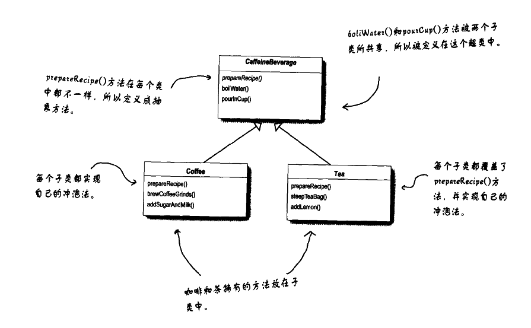
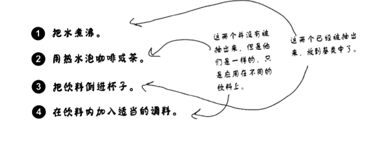

# 设计模式浅析(九) ·模板方法模式

## 日常叨逼叨

java设计模式浅析，如果觉得对你有帮助，记得一键三连，谢谢各位观众老爷😁😁


---


## 模板方法模式

### 概念

**模板方法模式**（Template Method Pattern）在Java中是一种非常实用的设计模式，它允许我们在一个方法中定义一个算法的骨架，同时允许子类在不改变算法结构的情况下重新定义某些步骤的具体内容。这种模式非常适合于那些算法的整体步骤固定，但某些步骤的具体实现可能因需求不同而有所变化的场景。

### 组成

1. **抽象类（Abstract Class）**：
   - 定义了一个或多个抽象方法，这些抽象方法由具体子类来实现。
   - 包含一个模板方法，这个方法定义了算法的骨架，并调用了在抽象类中定义的抽象方法。
   - 模板方法通常被声明为`final`，以防止子类覆盖它。
   - 模板方法通常还包含一些普通方法，这些方法可以被具体子类直接使用或覆盖。
2. **具体子类（Concrete Subclasses）**：
   - 实现了抽象类中定义的抽象方法，提供了这些抽象方法的具体实现。
   - 通过继承抽象类，子类可以重写普通方法，以提供不同的实现。
   - 子类可以通过调用父类的模板方法来执行算法。
3. **客户端**
   - 客户端代码创建具体类的实例，并调用模板方法来执行算法。

## 案例

> 继续以一家饮品店为例子：
>
> A饮品店有咖啡（coffee）和茶（tea）两种饮品，对于其制作方法如下：
>
> - 咖啡冲泡法
>
>   - (1)把水煮沸
>
>   - (2)用沸水冲泡咖啡
>
>   - (3)把咖啡倒进杯子
>
>   - (4)加糖和牛奶
>
> - 茶水冲泡法
>
>   - (1)把水煮沸
>
>   - (2)用沸水浸泡茶叶
>
>   - (3)把茶倒进杯子
>
>   - (4)加柠檬

让我们扮演冲泡师傅，快速的创建茶水和咖啡

```java
//coffee
public class Coffee {
    void prepareRecipe() {
        boilWater();
        brewCoffeeGrinds();
        pourInCup();
        addSugarAndMilk();
    }

    public void boilWater() {
        System.out.println("step 1 Boiling water");
    }

    public void brewCoffeeGrinds() {
        System.out.println("step 2 Dripping Coffee through filter");
    }

    public void pourInCup() {
        System.out.println("step 3 Pouring into cup");
    }

    public void addSugarAndMilk() {
        System.out.println("step 4 Adding Sugar and Milk");
    }
}
```

```java
//Tea
public class Tea {
    void prepareRecipe() {
        boilwater();
        steepTeaBag();
        pourInCup();
        addLemon();
    }

    public void boilwater() {
        System.out.println("step 1 Boiling water");
    }

    public void steepTeaBag() {
        System.out.println("step 2 Steeping the tea");
    }

    public void addLemon() {
        System.out.println("step 3 Adding Lemon");
    }

    public void pourInCup() {
        System.out.println("step 4 Pouring into cup");
    }
}
```

仔细观察上述的代码，会发现coffee和tea 除了第2步骤和第4步骤不一样外，其他的步骤几乎一致，代码存在者较高的冗余。是不是可以将一些代码抽取出来？

那么第一次抽取之后，类图可能会变成这个样子



但是仔细想一想上面的制作方法



让我们来思考这一点:浸泡(steep)和冲泡(brew)差异其实不大。所以我们给它一个新的方法名称，比方说brew()，然后不管是泡茶或冲泡咖啡我们都用这个名称。

类似地，加糖和牛奶也和加柠檬很相似:都是在饮料中加入调料，由此，我们再做一次公共的提取。

首先，我们定义一个抽象类`DrinksMake`，在其中定义一个final的方法，规定具体的步骤：

```java
abstract class DrinksMake {
    //模板方法
    public final void makeDrinks() {

        //step 1 烧水
        boiledWater();
        //step 2 冲泡
        brew();
        //step3 倒出到杯子中
        pourInCup();
        //step4 添加配料
        addTheIngredients();

    }


    protected abstract void addTheIngredients();

    protected abstract void brew();

    protected void boiledWater() {
        System.out.println("step1:boiled water!");
    }

    protected void pourInCup() {
        System.out.println("step3: pourInCup !");
    }


}
```

然后，我们定义制作咖啡的具体实现以及茶水的具体实现

```java
public class CoffeeMake extends DrinksMake {

    @Override
    protected void addTheIngredients() {
        System.out.println("step 4 : add Sugar and Milk into Coffee");
    }

    @Override
    protected void brew() {
        System.out.println("step 2 : brew Coffee");
    }
}
```

```java
public class TeaMake extends DrinksMake {


    @Override
    protected void addTheIngredients() {
        System.out.println("step 4 : add Lemon into tea");
    }

    @Override
    protected void brew() {
        System.out.println("step 2 : brew tea");
    }
}
```

那么对于客户端来说，我们分别制作一杯咖啡和一杯茶

```java
public class Client {
    public static void main(String[] args) {
        TeaMake teaMake = new TeaMake();
        CoffeeMake coffeeMake = new CoffeeMake();

        teaMake.makeDrinks();
        coffeeMake.makeDrinks();
    }
}
```

> 运行结果：
>
> step1:boiled water!
> step 2 : brew tea
> step3: pourInCup !
> step 4 : add Lemon into tea
> step1:boiled water!
> step 2 : brew Coffee
> step3: pourInCup !
> step 4 : add Sugar and Milk into Coffee
>
> Process finished with exit code 0

至此我们实现了设计模式中的模板方法模式

### 模板方法模式中的钩子hook

我们在上述的抽象父类中再加入一个方法 

```java
void hook(){}
//但是这个方法暂时什么都不做
```

我们也可以有**“默认不做事的方法”**，我们称这神方法为**“hook”**(钩子)。子类可以视情况决定要不要覆盖它们。接下来就会知道钩子的实际用途。

> 试想一下，如果在step4，添加小料的时候，是不是应该询问一下顾客的意见？不能问不问就为顾客添加一些小料，这个是不太合理的，那么我们的代码可以这么修改：

```java
abstract class DrinksMake {
    //模板方法
    public final void makeDrinks() {

        //step 1 烧水
        boiledWater();
        //step 2 冲泡
        brew();
        //step3 倒出到杯子中
        pourInCup();
        //step4 添加配料
        if (ifNeedIngredients()) {
            addTheIngredients();
        }

    }


    protected abstract void addTheIngredients();

    protected abstract void brew();

    protected void boiledWater() {
        System.out.println("step1:boiled water!");
    }

    protected void pourInCup() {
        System.out.println("step3: pourInCup !");
    }


    /***
     * 钩子方法，子类可以选择重写或者不重写
     */
    boolean ifNeedIngredients() {
        return true;
    }
    
}
```

> 创建一个类似于钩子的方法，默认返回是添加小料，可以在子类中进行重写进行相关的操作，我们可以在子类中进行询问顾客是否需要小料

```java
public class CoffeeMakeWithHook extends DrinksMake {

    @Override
    protected void addTheIngredients() {
        System.out.println("step 4 : add Sugar and Milk into Coffee");
    }

    @Override
    protected void brew() {
        System.out.println("step 2 : brew Coffee");
    }

    @Override
    boolean ifNeedIngredients() {
        String answer = getUserInput();
        if (answer.toLowerCase().startsWith("y")) {
            return true;
        } else
            return false;
    }

    //  让用户输入他们对调料的决定。根据用户的输入返回tue或false
    private String getUserInput() {
        String answer = null;
        System.out.print("would you like milk and sugar with your coffee (y/n) ?");
        BufferedReader in = new BufferedReader(new InputStreamReader(System.in));
        try {
            answer = in.readLine();
        } catch (IOException e) {
            System.err.println("IO error trying to read your answer");
        }
        if (answer == null) {
            return "no";
        }
        return answer;
    }
}

```

> 再次创建客户端代码，进行coffeewithhook的调用

```java
public class Client {
    public static void main(String[] args) {
        CoffeeMakeWithHook coffeeMake = new CoffeeMakeWithHook();
        coffeeMake.makeDrinks();

    }
}
```

> 运行结果如下:
>
> 不需要：
>
> step1:boiled water!
> step 2 : brew Coffee
> step3: pourInCup !
> would you like milk and sugar with your coffee (y/n) ?n
>
> Process finished with exit code 0
>
> 需要：
>
> step1:boiled water!
> step 2 : brew Coffee
> step3: pourInCup !
> would you like milk and sugar with your coffee (y/n) ?y
> step 4 : add Sugar and Milk into Coffee
>
> Process finished with exit code 0


## 优缺点

### 优点：

1. **代码复用**：模板方法模式允许你定义一个算法的骨架，而将一些步骤延迟到子类中。这允许子类在不改变算法结构的情况下重定义某些步骤的具体内容，从而实现了代码的复用。
2. **扩展性**：由于模板方法模式将算法中的固定部分与可变部分分离，这使得子类可以通过扩展来增加新的行为，从而提高了代码的扩展性。
3. **封装性**：通过将不变的部分封装在父类中，模板方法模式隐藏了实现细节，只暴露必要的接口给子类。这有助于减少子类的耦合度。
4. **行为控制**：模板方法模式允许通过子类覆盖父类的钩子方法来决定某一特定步骤是否需要执行，从而提供了一种反向控制结构。

### 缺点：

1. **代码可读性**：由于模板方法模式中的钩子方法和抽象方法的调用顺序可能比较复杂，这可能会增加代码的阅读难度，尤其是对于新手来说。
2. **继承的缺点**：模板方法模式依赖于继承来实现代码复用，而继承本身有一些固有的缺点，如破坏封装性、子类与父类之间的强耦合等。
3. **扩展限制**：如果父类中的模板方法被声明为`final`，那么子类将无法覆盖该方法，这可能会限制子类的扩展性。

总的来说，Java模板方法模式在需要定义一系列复杂算法时非常有用，它能够有效地实现代码复用和扩展。然而，它也有一些缺点需要注意，如代码可读性和继承的局限性等。因此，在使用模板方法模式时，需要根据具体情况权衡其优缺点。

---

代码相关代码可以参考 **[代码仓库🌐](https://gitee.com/jerrylau213/DesignPatterns)**

**ps：本文原创，转载请注明出处**

---