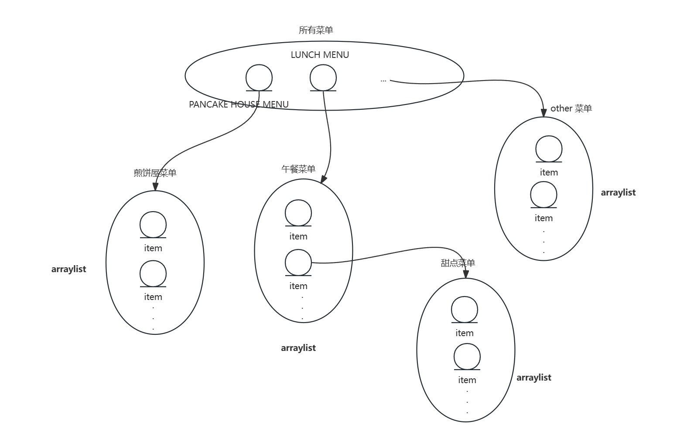
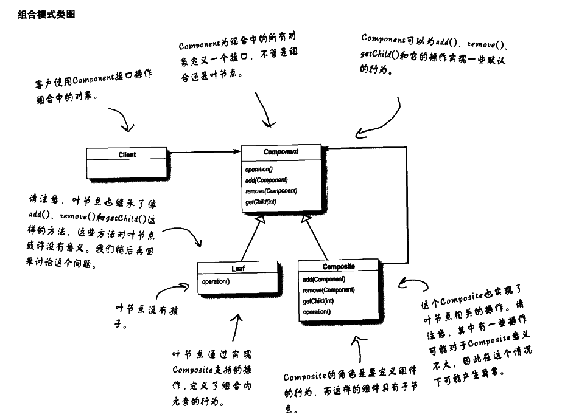
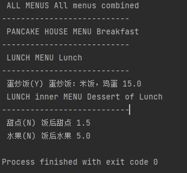

# 设计模式浅析(十) ·设计模式之迭代器|组合模式

## 日常叨逼叨

java设计模式浅析，如果觉得对你有帮助，记得一键三连，谢谢各位观众老爷😁😁


## 案例

> 有两家门店，门店A呢只提供早餐，门店B呢只提供午餐，有一天这两家店铺想要进行合并，一起做大做强，再创辉煌。
>
> 合并后呢，对于菜单的定制存在了一定的问题：
>
> 门店A的菜单采用了ArrayList进行存储，但是门店B的菜单之前是采用了数组进行存储，那么在合并之后，对于服务员来说，怎么才能将菜单展示出来，是一件比较头疼的事情

旧的门店A的菜单构成:

```java
/**
 * @version 1.0
 * @Author jerryLau
 * @Date 2024/2/29 14:37
 * @注释 A餐馆的馅饼菜单
 */
public class PanCakeMenu {
    private ArrayList menuItems;

    public PanCakeMenu() {
        menuItems = new ArrayList<>();

        addItem("K&B PanCake", "PanCake with eggs and beef", true, 18.0);
        addItem("normal PanCake", "PanCake with eggs", true, 10.0);
        addItem("blueberry PanCake", "PanCake with blue and cheese", false, 13.0);
    }

    private void addItem(String name, String disc, boolean vegetarian, double price) {

        menuItems.add(new MenuItem(name, disc, vegetarian, price));

    }
    public ArrayList getMenuItems() {
        return menuItems;
    }
}
```

旧的门店B的菜单组成：

```java
/**
 * @version 1.0
 * @Author jerryLau
 * @Date 2024/2/29 14:37
 * @注释 B餐馆的午餐菜单
 */
public class LunchMenu {
    static final Integer MAX_VALUE = 3;
    int index = 0;
    private MenuItem[] menuItems;

    public LunchMenu() {
        menuItems = new MenuItem[MAX_VALUE];

        addItem("single lunch", "hot dog with coke", true, 18.0);
        addItem("soup", "soup with cake for lunch", true, 19.0);
        addItem("Tomato and egg rice bowl", "rice with Tomato and egg for lunch", true, 21.0);
    }

    private void addItem(String name, String disc, boolean vegetarian, double price) {
        if (menuItems.length > MAX_VALUE) {
            System.out.println("menu is full, not allowed to insert !");
        } else {
            menuItems[index] = new MenuItem(name, disc, vegetarian, price);
            index++;
        }
    }

  public MenuItem[] getMenuItems() {
        return menuItems;
   }
   
}
```

那么对于服务员来说，在合并门店之后，如果实现简单的菜单组合，服务员代码可能如下：

```java
/**
 * @version 1.0
 * @Author jerryLau
 * @Date 2024/2/29 15:01
 * @注释 合并后的B餐厅的waiter
 */
public class Waiter {
    private PanCakeMenu panCakeMenu;
    private LunchMenu lunchMenu;

    public Waiter(PanCakeMenu panCakeMenu, LunchMenu lunchMenu) {
        this.panCakeMenu = panCakeMenu;
        this.lunchMenu = lunchMenu;
    }

    public void showMenu() {
        //展示菜单
        ArrayList menuItems = panCakeMenu.getMenuItems();
        MenuItem[] menuItems1 = lunchMenu.getMenuItems();

        for (int i = 0; i < menuItems.size(); i++) {
            MenuItem a = (MenuItem) menuItems.get(i);
            System.out.println(a.toString());
        }

        for (int i = 0; i < menuItems1.length; i++) {
            MenuItem MenuItem = menuItems1[i];
            System.out.println(MenuItem.toString());
        }
    }

}
```

> 运行结果：
> 
> breakfast-
> MenuItem{name='K&B PanCake', disc='PanCake with eggs and beef', vegetarian=true, price=18.0}
> MenuItem{name='normal PanCake', disc='PanCake with eggs', vegetarian=true, price=10.0}
>MenuItem{name='blueberry PanCake', disc='PanCake with blue and cheese', vegetarian=false, price=13.0}
> lunch-
> MenuItem{name='single lunch', disc='hot dog with coke', vegetarian=true, price=18.0}
> MenuItem{name='soup', disc='soup with cake for lunch', vegetarian=true, price=19.0}
> MenuItem{name='Tomato and egg rice bowl', disc='rice with Tomato and egg for lunch', vegetarian=true, price=21.0}eese 13.0  


虽然呢，对于服务员来说，貌似实现了这个`showmenu()`这个功能，但是如果后期再加入一个门店，是不是又得写一个循环去进行第三家门店菜单的遍历？

那么有没有办法进行优化一些呢？

我们来进行分析一下：

1. 要遍历早餐项，我们需要使用**ArrayList**的`size()`和`get()`方法

2. 要遍历午餐项，我们需要使用**数组**的`length`字段和中括号`[]`

3. 现在我们创建一个对象，将它称为迭代器(**Iterator**)，利用它来封装“遍历集合内的每个对象的过程”。先让我们在ArrayList上试试:

```java
Iterator iterator1 = panCakeMenu.createIterator();
while (iterator1.hasNext()) {
	System.out.println(iterator1.next().toString());
 }
```
4. 然后在数组上试一试：

```java
MealIterator iterator = lunchMenu.createIterator();
while (iterator.hasNext()){
    	System.out.println(iterator.next().toString());
}
```
那么我们创建一个**MealIterator**迭代器，暂时为**lunchMenu**服务
```java
/**
 * @version 1.0
 * @Author jerryLau
 * @Date 2024/2/29 15:11
 * @注释 MealIterator
 */
public class MealIterator implements Iterator {
    private MenuItem[] menuItems;
    private int index = 0;

    public MealIterator(MenuItem[] menuItems) {
        this.menuItems = menuItems;
    }

    @Override
    public boolean hasNext() {
        if (menuItems.length <= index||menuItems[index]==null) {
            return false;
        } else
            return true;
    }

    @Override
    public Object next() {

        MenuItem menuItem = menuItems[index];
        index++;
        return menuItem;
    }

    @Override
    public void remove() {
        if (index < 0) {
            throw new IllegalArgumentException("list is empty，no element can be removed !");
        }
        if (menuItems[index - 1] != null) {
            for (int i = index - 1; i < (menuItems.length - 1); i++) {
                menuItems[i] = menuItems[i + 1];
            }
            menuItems[index - 1] = null;
        }

    }
}
```

使用上述的迭代器，重构菜单
```java
/**
 * @version 1.0
 * @Author jerryLau
 * @Date 2024/2/29 14:37
 * @注释 B餐馆的午餐菜单
 */
public class LunchMenu {
    static final Integer MAX_VALUE = 5;
    int index = 0;
    private MenuItem[] menuItems;

    public LunchMenu() {
        menuItems = new MenuItem[MAX_VALUE];
        addItem("single lunch", "hot dog with coke", true, 18.0);
        addItem("soup", "soup with cake for lunch", true, 19.0);
        addItem("Tomato and egg rice bowl", "rice with Tomato and egg for lunch", true, 21.0);
    }

    private void addItem(String name, String disc, boolean vegetarian, double price) {
        if (menuItems.length > MAX_VALUE) {
            System.out.println("menu is full, not allowed to insert !");
        } else {
            menuItems[index] = new MenuItem(name, disc, vegetarian, price);
            index++;
        }
    }
    public MealIterator createIterator() {
        return new MealIterator(menuItems);
    }
}
```

相应的，服务员类也进行重构
```java
/**
 * @version 1.0
 * @Author jerryLau
 * @Date 2024/2/29 15:01
 * @注释 合并后的B餐厅的waiter
 */
public class Waiter {
    private PanCakeMenu panCakeMenu;
    private LunchMenu lunchMenu;

    public Waiter(PanCakeMenu panCakeMenu, LunchMenu lunchMenu) {
        this.panCakeMenu = panCakeMenu;
        this.lunchMenu = lunchMenu;
    }

    public void showMenu() {
        //展示菜单

        Iterator iterator1 = panCakeMenu.createIterator();
        MealIterator iterator = lunchMenu.createIterator();
        System.out.println("breakfast-");
        showMenu(iterator1);
        System.out.println("lunch-");
        showMenu(iterator);
    }

    public void showMenu(Iterator iterator) {
        while (iterator.hasNext()) {
            System.out.println(iterator.next().toString());
        }
    }
}
```

这个选代器让服务员能够从具体类的实现中解耦。她不需要知道菜单是使用数组、ArrayList，还是便利贴来实现。她只关心她能够取得选代器。

但是对于服务员来说，他还持有两个接口的具体实现类，有点违背了我们面向接口编程而不是面向接口的实现编程这一原则，我们在重构一下代码。

- 创建**Menu**接口
```java
/**
 * @version 1.0
 * @Author jerryLau
 * @Date 2024/2/29 14:37
 * @注释 menu 公共接口
 */
public interface Menu {
    Iterator createIterator();
}
```

- 让**PanCakeMenu**和**LunchMenu**实现接口
```java
/**
 * @version 1.0
 * @Author jerryLau
 * @Date 2024/2/29 14:37
 * @注释 B餐馆的午餐菜单
 */
public class LunchMenu implements Menu{
    static final Integer MAX_VALUE = 5;
    int index = 0;
    private MenuItem[] menuItems;

    public LunchMenu() {
        menuItems = new MenuItem[MAX_VALUE];

        addItem("single lunch", "hot dog with coke", true, 18.0);
        addItem("soup", "soup with cake for lunch", true, 19.0);
        addItem("Tomato and egg rice bowl", "rice with Tomato and egg for lunch", true, 21.0);
    }

    private void addItem(String name, String disc, boolean vegetarian, double price) {
        if (menuItems.length > MAX_VALUE) {
            System.out.println("menu is full, not allowed to insert !");
        } else {
            menuItems[index] = new MenuItem(name, disc, vegetarian, price);
            index++;
        }
    }

    public Iterator createIterator() {
        return new MealIterator(menuItems);
    }
}
```

- 让服务员持有接口**Menu**

```java
/**
 * @version 1.0
 * @Author jerryLau
 * @Date 2024/2/29 15:01
 * @注释 合并后的B餐厅的waiter
 */
public class Waiter {
    private Menu panCakeMenu;
    private Menu lunchMenu;

    public Waiter(Menu panCakeMenu, Menu lunchMenu) {
        this.panCakeMenu = panCakeMenu;
        this.lunchMenu = lunchMenu;
    }

    public void showMenu() {
        //展示菜单
        Iterator iterator1 = panCakeMenu.createIterator();
        Iterator iterator = lunchMenu.createIterator();
        System.out.println("breakfast-");
        showMenu(iterator1);
        System.out.println("lunch-");
        showMenu(iterator);
    }

    public void showMenu(Iterator iterator) {
        while (iterator.hasNext()) {
            System.out.println(iterator.next().toString());
        }
    }
}
```
你可能会奇怪，为什么我们不使用Java的Iterator接口呢--我们之所以这么做，是为了要让你了解如何从头创建一个迭代器。现在目的达到了，如果再有店铺合并，可以使用java的Iterator接口。

## 迭代器模式

**Java设计模式中的迭代器模式介绍**

迭代器模式是一种行为型设计模式，它提供了一种方法来顺序访问一个聚合对象中的各个元素，而无需知道或暴露该对象的内部表示。在Java中，迭代器模式是通过`java.util.Iterator`接口来实现的。

### **元素**

迭代器模式涉及以下几个主要的元素：

1. **迭代器（Iterator）**：这是一个接口或抽象类，它定义了访问和遍历聚合对象中的元素的方法。在Java中，这通常是一个名为`iterator()`的方法，它返回一个实现了`Iterator`接口的对象。
2. **具体迭代器（ConcreteIterator）**：这是迭代器接口的具体实现。它负责遍历聚合对象中的元素，并提供了获取下一个元素、检查是否还有更多元素等方法。
3. **聚合（Aggregate）**：这是一个接口或抽象类，它定义了创建迭代器对象的方法。在Java中，这通常是一个名为`iterator()`的方法。
4. **具体聚合（ConcreteAggregate）**：这是聚合接口的具体实现。它实现了创建迭代器对象的方法，并返回与聚合对象相关联的具体迭代器。

### **优缺点**

#### **优点**：

1. **简化遍历**：迭代器模式提供了一种简单的方式来遍历聚合对象中的元素，而无需了解聚合对象的底层表示。
2. **多种遍历方式**：通过实现不同的迭代器类，可以为同一个聚合对象提供多种遍历方式。
3. **封装性**：使用迭代器模式，客户端代码只需要知道如何使用迭代器，而无需关心聚合对象的内部实现。

#### **缺点**：

1. **增加类的数量**：由于迭代器模式将存储数据和遍历数据的职责分离，每个聚合类可能需要对应一个迭代器类，这可能会增加系统的复杂性。
2. **遍历效率**：对于简单的聚合对象（如数组或有序列表），使用迭代器进行遍历可能比直接访问元素更加繁琐和效率低下。

### **适用场景**

迭代器模式通常适用于以下场景：

1. 需要遍历聚合对象的场景，而又不希望客户端代码了解聚合对象的底层表示。
2. 需要为聚合对象提供多种遍历方式的场景。
3. 需要统一遍历接口的场景，以简化客户端代码。
4. 在Java中，`java.util.Iterator` 接口就是迭代器模式的实现。当你有一个集合（如 `List`、`Set` 等）并想要遍历其中的元素时，你可以使用迭代器。


> 正当我们觉得这样很周全时，突然又有一个新的需求，店家B想在午餐的菜单中添加一种午后甜点的“子菜单”
>
> 如果我们能让甜点菜单变成餐厅菜单集合的一个元素，那该有多好。但是根据现在的实现，根本做不到。
>
> 上述需求类似于这样：



那么我们不得不考虑用一些新的设计，因为我们需要表现菜单、嵌套子菜单和菜单项，我们很自然地采用树形结构以便符合这样的需求

> 所以，在我们的新设计中，真正需要些什么呢?
> 我们需要某种树形结构，可以容纳菜单、子菜单和菜单项。
> 我们需要确定能够在每个菜单的各个项之间游走，而且至少要像现在用迭代器一样方便。
> 我们也需要能够更有弹性地在菜单项之间游走。比方说，可能只需要遍历甜点菜单，或者可以遍历餐厅的整个菜单(包括甜点菜单在内)

没错，我们要介绍另一个模式解决这个难题。我们并没有放弃迭代器--它仍然是我们解决方案中的一部分--然而，管理菜单的问题已经到了一个迭代器无法解决的新维度。所以，我们将倒退几步，改用组合模式(Composite Pattern)来实现这一部分。
对于这个模式，我们不打算深入探讨，只在这里提出它的正式定义:

## 组合模式

**定义：**组合模式允许你将对象组合成树形结构来表现“整体/部分”层次结构。组合能让客户以一致的方式处理个别对象以及对象组合。

**类图**：



我们要如何在菜单上应用组合模式呢?一开始，我们需要创建一个组件接口来作为菜单和菜单项的共同接口，让我们能够用统一的做法来处理菜单和菜单项。换句话说，我们可以针对菜单或菜单项调用相同的方法。

首先可以创建菜单组件

```java
public abstract class MenuComponent {
    //操作 range start
    public void add(MenuComponent menuComponent) {
        throw new UnsupportedOperationException();
    }

    public void remove(MenuComponent menuComponent) {
        throw new UnsupportedOperationException();
    }

    public MenuComponent getChild(int i) {
        throw new UnsupportedOperationException();
    }
    //操作 range end

    //基本属性 range start
    public String getName() {
        throw new UnsupportedOperationException();
    }

    public String getDescription() {
        throw new UnsupportedOperationException();
    }

    public double getPrice() {
        throw new UnsupportedOperationException();
    }

    public boolean isVegetarian() {
        throw new UnsupportedOperationException();
    }

    public void print() {
        throw new UnsupportedOperationException();
    }
    //基本属性 range end
}
```

然后创建菜单项继承菜单组件

```java
public class MenuItem extends MenuComponent {
    private String name;
    private String description;
    private double price;
    private boolean isVegetarian;

    public MenuItem(String name, String description, double price, boolean isVegetarian) {
        this.name = name;
        this.description = description;
        this.price = price;
        this.isVegetarian = isVegetarian;
    }

    @Override
    public String getName() {
        return name;
    }

    @Override
    public String getDescription() {
        return description;
    }

    @Override
    public double getPrice() {
        return price;
    }

    @Override
    public boolean isVegetarian() {
        return isVegetarian;
    }

    @Override
    public void print() {
        System.out.println(" " + getName() + (isVegetarian() ? "(N)" : "(Y)") + " " + getDescription() + " " + getPrice() + " ");
    }
}

```

同样创建菜单，也是继承自菜单组件

```java
public class Menu extends MenuComponent {
    List<MenuComponent> menuComponents = new ArrayList<MenuComponent>();
    private String name;
    private String description;


    public Menu(String name, String description) {
        this.name = name;
        this.description = description;

    }

    @Override
    public void add(MenuComponent menuComponent) {
        menuComponents.add(menuComponent);
    }

    @Override
    public void remove(MenuComponent menuComponent) {
        menuComponents.remove(menuComponent);
    }

    @Override
    public MenuComponent getChild(int i) {
        return menuComponents.get(i);
    }

    @Override
    public String getName() {
        return name;
    }

    @Override
    public String getDescription() {
        return description;
    }


    @Override
    public void print() {
        System.out.println(" " + getName()+" " + getDescription());
        System.out.println("---------------------------");

        Iterator<MenuComponent> iterator = menuComponents.iterator();
        while (iterator.hasNext()) {
            MenuComponent next = iterator.next();
            next.print();
        }


    }
}
```

那么对于服务员来说，可以进行以下修改

```java
public class Waiter {
    MenuComponent allMenus;

    public Waiter(MenuComponent allMenus) {
        this.allMenus = allMenus;
    }

    public void printMenu() {
        allMenus.print();
    }
}
```

创建测试类

```java
public class MenuTestDriver {
    public static void main(String[] args) {
        MenuComponent menuComponentA = new Menu("PANCAKE HOUSE MENU", "Breakfast");
        MenuComponent menuComponentB = new Menu("LUNCH MENU", "Lunch");
        MenuComponent innerMenu = new Menu("LUNCH inner MENU", "Dessert of Lunch ");
        MenuComponent allMenus = new Menu("ALL MENUS", "All menus combined");

        allMenus.add(menuComponentA);
        allMenus.add(menuComponentB);

        menuComponentB.add(new MenuItem("蛋炒饭", "蛋炒饭：米饭，鸡蛋", 15.0, false));
        menuComponentB.add(innerMenu);
        innerMenu.add(new MenuItem("甜点", "饭后甜点", 1.5, true));
        innerMenu.add(new MenuItem("水果", "饭后水果", 5.0, true));

        Waiter waiter = new Waiter(allMenus);
        waiter.printMenu();

    }

}
```

运行结果



至此，我们通过了组合模式，实现了菜单的管理

下面我们一起来总结以下组合模式相关的内容

### 元素

组合模式主要包含三个要素：

1. **抽象根节点（Component）**：定义系统各层次对象的共有方法和属性，可以预先定义一些默认行为和属性。在抽象根节点中，通常会定义访问及管理其子构件的方法，如增加子节点、删除子节点、获取子节点等。
2. **叶子节点（Leaf）**：叶子节点对象，其下再无分支，是系统层次遍历的最小单位。在组合结构中，叶子节点没有子节点，它实现了在抽象根节点中定义的行为。
3. **树枝节点（Composite）**：定义树枝节点的行为，存储子节点，组合树枝节点和叶子节点形成一个树形结构。树枝节点可以包含树枝节点，也可以包含叶子节点，它其中有一个集合可以用于存储子节点，实现了在抽象根节点中定义的行为。在其业务方法中可以递归调用其子节点的业务方法。

### 优缺点

组合模式的优点主要有：

- **简化客户端代码**：组合模式使得客户端代码可以一致地处理单个对象和组合对象，无须关心自己处理的是单个对象还是组合对象。
- **增加新的构件方便**：在组合体内加入新的对象很容易，客户端不会因为加入了新的对象而更改源代码。
- **开闭原则**：组合模式符合开闭原则，对扩展开放，对修改封闭。
- **灵活的解决方案**：为树形结构的面向对象实现提供了一种灵活的解决方案，通过叶子对象和容器对象的递归组合可以形成复杂的树形机构，但对树形结构的控制却很简单。

然而，组合模式也存在一些缺点：

- **违反依赖倒置原则**：在使用组合模式时，其叶子和树枝的声明都是实现类，而不是接口，这在一定程度上违反了依赖倒置原则。
- **设计较复杂**：客户端需要花更多时间理清类之间的层次关系。
- **不容易限制容器中的构件**：在组合模式中，不容易限制容器中可以包含的构件类型。

---

代码相关代码可以参考 **[代码仓库🌐](https://gitee.com/jerrylau213/DesignPatterns)**

**ps：本文原创，转载请注明出处**

---