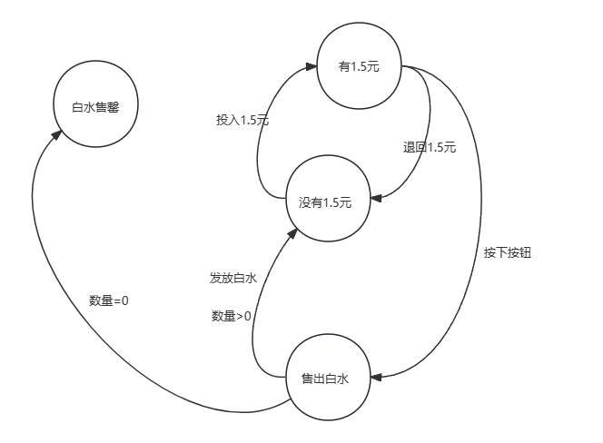

# 设计模式浅析(十一) ·状态模式

## 日常叨逼叨

java设计模式浅析，如果觉得对你有帮助，记得一键三连，谢谢各位观众老爷😁😁


---

## 状态模式

#### 概念

**状态模式**

Java中的状态模式（State Pattern）是一种行为型设计模式，它允许一个对象在其内部状态改变时改变它的行为，看起来就像修改了它的类一样。状态模式的核心在于将状态与行为绑定，不同的状态对应不同的行为。

### 举个🌰

> 假设自动贩卖机只贩卖白水这一种商品，自动贩卖机的设计师为我们提供了一张状态图，希望我们设计程序供他们的机器使用，我们先来看一下



经过一番研究，我们可以看得出，上述的状态转化图，我们可以试着将其转化为代码

首先，列出所有的状态

> `白水售罄`，`售出白水`，`有1.5元`，`没有1.5元`

然后定义一些表示状态的变量

```java
final static Integer SOLD_OUT=0;
final static Integer NO_MONEY_1_5=1;
final static Integer HAS_MONEY_1_5=2;
final static Integer SOLD=3;
```

将整个售卖过程整合起来，对于售卖机器而言

```java
 public void insertMoney() {
        if (state == HAS_MONEY_1_5) {
            //...
            System.out.println("you can't insert money ");
        } else if (state == SOLD_OUT) {
            //...
            System.out.println("you can't insert money , the machine is sold out");
        } else if (state == SOLD) {
            //...
            System.out.println("please wait, we give you a bottom of water");
        } else if (state == NO_MONEY_1_5) {
            state = HAS_MONEY_1_5;
            System.out.println("you inserted money");
        }
    }
```

接着上面的逻辑，我们实现整个自动化的白水贩卖机

```java
package com.jerry.statepattern;

/**
 * @version 1.0
 * @Author jerryLau
 * @Date 2024/4/7 16:08
 * @注释 自动售卖机
 */
public class VendingMachines {
    final static Integer SOLD_OUT = 0;
    final static Integer NO_MONEY_1_5 = 1;
    final static Integer HAS_MONEY_1_5 = 2;
    final static Integer SOLD = 3;

    int state = SOLD_OUT;
    int count = 0;

    public VendingMachines(int count) {
        this.count = count;
        if (count > 0) {
            state = NO_MONEY_1_5;
        }
    }

    /***
     * 投币
     */
    public void insertMoney() {
        if (state == HAS_MONEY_1_5) {
            System.out.println("you can't insert money ");
        } else if (state == SOLD_OUT) {
            System.out.println("you can't insert money , the machine is sold out");
        } else if (state == SOLD) {
            System.out.println("please wait, we give you a bottom of water");
        } else if (state == NO_MONEY_1_5) {
            state = HAS_MONEY_1_5;
            System.out.println("you inserted money");
        }
    }

    /***
     * 退币
     */
    public void ReturnMoney() {
        if (state == HAS_MONEY_1_5) {
            System.out.println("money returned");
            state = NO_MONEY_1_5;
        } else if (state == SOLD_OUT) {
            System.out.println("you can't return,you have not  insert money yet ");
        } else if (state == SOLD) {
            System.out.println("you already passed the button");
        } else if (state == NO_MONEY_1_5) {
            System.out.println("you have not  insert money");
        }
    }


    /***
     * 按钮按下
     */
    public void passButton() {
        if (state == HAS_MONEY_1_5) {
            System.out.println("you passed the button ...");
            state = SOLD;
            //发放水
            distribute();
        } else if (state == SOLD_OUT) {
            System.out.println("you passed the button,but no water sold ");
        } else if (state == SOLD) {
            System.out.println("pass button twice doesn't get another water");
        } else if (state == NO_MONEY_1_5) {
            System.out.println("you passed the button,but you should insert money first");
        }

    }

    /***
     * 分发水
     */
    public void distribute() {
        if (state == SOLD) {
            System.out.println("A bottom of water comes rolling out the slot");
            count = count - 1;
            if (count == 0) {
                System.out.println("Oops,out of water!");
                state = SOLD_OUT;
            } else {
                state = NO_MONEY_1_5;
            }
        } else if (state == NO_MONEY_1_5) {
            System.out.println("You need to pay first");
        } else if (state == SOLD_OUT) {
            System.out.println("No water distributed");
        } else if (state == HAS_MONEY_1_5) {
            System.out.println("No water distributed");
        }

    }
    //....

    @Override
    public String toString() {
        return "VendingMachines{" +
                "state=" + state +
                ", count=" + count +
                '}';
    }
}
```

准备测试类

```java
package com.jerry.statepattern;

/**
 * @version 1.0
 * @Author jerryLau
 * @Date 2024/4/7 16:09
 * @注释  VendingMachines 测试
 */
public class VendingMachinesTestMain {

    public static void main(String[] args) {
        VendingMachines gumballMachine = new VendingMachines(5);

        System.out.println(gumballMachine);

        gumballMachine.insertMoney();
        gumballMachine.passButton();
        System.out.println(gumballMachine);

        gumballMachine.insertMoney();
        gumballMachine.ReturnMoney();
        gumballMachine.passButton();
        System.out.println(gumballMachine);
//
//
        gumballMachine.insertMoney();
        gumballMachine.passButton();
        gumballMachine.insertMoney();
        gumballMachine.passButton();
        gumballMachine.ReturnMoney();
        System.out.println(gumballMachine);
//
        gumballMachine.insertMoney();
        gumballMachine.insertMoney();
        gumballMachine.passButton();
        gumballMachine.insertMoney();
        gumballMachine.passButton();
        gumballMachine.insertMoney();
        gumballMachine.passButton();
        System.out.println(gumballMachine);

    }
}

```

运行结果

> VendingMachines{state=1, count=5}
> you inserted money
> you passed the button ...
> A bottom of water comes rolling out the slot
> VendingMachines{state=1, count=4}
> you inserted money
> money returned
> you passed the button,but you should insert money first
> VendingMachines{state=1, count=4}
> you inserted money
> you passed the button ...
> A bottom of water comes rolling out the slot
> you inserted money
> you passed the button ...
> A bottom of water comes rolling out the slot
> you have not  insert money
> VendingMachines{state=1, count=2}
> you inserted money
> you can't insert money 
> you passed the button ...
> A bottom of water comes rolling out the slot
> you inserted money
> you passed the button ...
> A bottom of water comes rolling out the slot
> Oops,out of water!
> you can't insert money , the machine is sold out
> you passed the button,but no water sold 
> VendingMachines{state=0, count=0}
>
> Process finished with exit code 0

> 感觉好像没什么太大的问题，我们将代码提交给自动贩卖机的老板，他们再运行后觉得非常完美，但就是太过完美了，他们想玩点花的，提出了下面的需求：
>
> `当用户投币后按下按钮后，有10%的几率掉下来的是两瓶水(多送你一瓶），这将大大加大销售量`

对于他们提出的需求，emmm大概想了想，在现有代码中修改的地方比较多

- 加一个状态
- 对于每个步骤都得进行添加新状态的判断
- 对于按下按钮这一方法里面的内容进行大量的修改

如果采用在现在代码上进行修改，会存在以下几种问题

- 这份代码确实没有遵守开放-关闲原则。
- 这个设计其实不符合面向对象。
- 状态转换被埋藏在条件语句中，所以不明显。
- 我们还没有把会改变的那部分包装来。
- 未来加人的代码很有可能会导致bug。

> 考虑到可能会出现以上的问题，我们决定做如下新的设计
>
> 我们的计划是这样的:不要维护我们现有的代码，我们重写它以便于将状态对象封装在各自的类中，然后在动作发生时委托给当前状态。
>
> 我们在这里遵照我们的设计原则，所以最后应该得到一个容易维护的设计。
>
> 我们要做的事情是:
>
> - 首先，我们定义一个State接口。在这个接口内，贩卖机的每个动作都有一个对应的方法。
> - 然后为机器中的每个状态实现状态类。这些类将负责在对应的状态下进行机器的行为。
> - 最后，我们要摆脱旧的条件代码，取而代之的方式是，将动作委托到状态类。
>
> 你将会看到，我们不仅遵守了设计原则，实际上我们还实现了状态模式。在重新完成代码之后我们再来了解状态模式的正式定义…


```java
package com.jerry.statepattern.newDisign;

/**
 * @version 1.0
 * @Author jerryLau
 * @Date 2024/4/8 8:42
 * @注释 新的状态的额接口
 */
public interface State {
    /***
     * 投币
     */
    public void insertMoney();

    /***
     * 退币
     */
    public void returnMoney() ;

    /***
     * 按钮按下
     */
    public void passButton() ;

    /***
     * 分发水
     */
    public void distribute() ;
}

```

状态有点多，我们简单的列举一二

```java
package com.jerry.statepattern.newDisign;

/**
 * @version 1.0
 * @Author jerryLau
 * @Date 2024/4/8 8:45
 * @注释 没有被投币的状态
 */
public class No1_5State implements  State{
    NewVendingMachines newVendingMachines;

    public No1_5State(NewVendingMachines newVendingMachines) {
        this.newVendingMachines = newVendingMachines;
    }

    @Override
    public void insertMoney() {
        System.out.println("you insert money");
        newVendingMachines.setState(newVendingMachines.getHas1_5State());
    }

    @Override
    public void returnMoney() {
        System.out.println("you aren't insert money");
    }

    @Override
    public void passButton() {
        System.out.println("you passed Button,but no water gives to you cause you aren't insert money");
    }

    @Override
    public void distribute() {
        System.out.println("you need to pay first");
    }
}

```

```java
package com.jerry.statepattern.newDisign;

/**
 * @version 1.0
 * @Author jerryLau
 * @Date 2024/4/8 8:44
 * @注释 售出状态
 */
public class SoldState implements State {
    NewVendingMachines newVendingMachines;

    public SoldState(NewVendingMachines newVendingMachines) {
        this.newVendingMachines = newVendingMachines;
    }

    @Override
    public void insertMoney() {
        System.out.println("please wait a moment ,we will give you a bottom of water");
    }

    @Override
    public void returnMoney() {
        System.out.println("no money returned cause you have passed the button");
    }

    @Override
    public void passButton() {
        System.out.println("passed the button twice doesn't give another water ");
    }

    @Override
    public void distribute() {
        newVendingMachines.flushWater();
        if (newVendingMachines.getCount() > 0) {
            newVendingMachines.setState(newVendingMachines.getNo1_5State());
        } else {
            newVendingMachines.setState(newVendingMachines.getSoldOutState());
        }
    }
}

```

添加上赢家的状态

```java
package com.jerry.statepattern.newDisign;

/**
 * @version 1.0
 * @Author jerryLau
 * @Date 2024/4/8 8:46
 * @注释 产生赢家状态
 */
public class WinnerState implements State {
    NewVendingMachines newVendingMachines;

    public WinnerState(NewVendingMachines newVendingMachines) {
        this.newVendingMachines = newVendingMachines;
    }

    @Override
    public void insertMoney() {
        System.out.println("no need to insert money");
    }

    @Override
    public void returnMoney() {
        System.out.println("no money return");
    }

    @Override
    public void passButton() {
        System.out.println("you passed money but no water gives to you ");
    }

    @Override
    public void distribute() {
        System.out.println("YOU'RE a WINNER! You get another water ");
        newVendingMachines.flushWater();
        if (newVendingMachines.getCount() == 0) {
            newVendingMachines.setState(newVendingMachines.getSoldOutState());
        } else {
            newVendingMachines.flushWater();
            if (newVendingMachines.getCount() > 0) {
                newVendingMachines.setState(newVendingMachines.getNo1_5State());
            } else {
                System.out.println("Oops,out of water!");
                newVendingMachines.setState(newVendingMachines.getSoldOutState());
            }
        }
    }
}
```

那么持有1.5元状态（投币状态）代码就会在进行响应的修改

```java
package com.jerry.statepattern.newDisign;

/**
 * @version 1.0
 * @Author jerryLau
 * @Date 2024/4/8 8:45
 * @注释 被投币状态
 */
public class Has1_5State implements State {
    NewVendingMachines newVendingMachines;

    public Has1_5State(NewVendingMachines newVendingMachines) {
        this.newVendingMachines = newVendingMachines;
    }

    @Override
    public void insertMoney() {
        System.out.println("you have insert money, no more money need insert");
    }

    @Override
    public void returnMoney() {
        System.out.println("money returned");
        newVendingMachines.setState(newVendingMachines.getNo1_5State());
    }

    @Override
    public void passButton() {
        System.out.println("you passed the button...");

        int winner = (int)(Math.random()*10);
        if ((winner == 0) && (newVendingMachines.getCount() > 1)) {
            newVendingMachines.setState(newVendingMachines.getWinnerState());
        } else {
            newVendingMachines.setState(newVendingMachines.getSoldState());
        }
    }

    @Override
    public void distribute() {
        System.out.println("no water distributed");
    }
}

```

此外呢，贩卖机也做如下修改

```java
package com.jerry.statepattern.newDisign;

/**
 * @version 1.0
 * @Author jerryLau
 * @Date 2024/4/7 16:08
 * @注释 自动售卖机
 */
public class NewVendingMachines {
    State soldState;
    State soldOutState;
    State has1_5State;
    State no1_5State;

    State winnerState;

    State state = soldOutState;
    int count = 0;

    public NewVendingMachines(int count) {

        soldState = new SoldState(this);
        soldOutState = new SoldOutState(this);
        has1_5State = new Has1_5State(this);
        no1_5State = new No1_5State(this);
        winnerState = new WinnerState(this);
        this.count = count;
        if (count > 0) {
            state = no1_5State;
        }
    }

    public void insertMoney() {
        state.insertMoney();
    }

    /***
     * 退币
     */
    public void returnMoney() {
        state.returnMoney();
    }


    /***
     * 按钮按下
     */
    public void passButton() {
        state.passButton();
        state.distribute();
    }

    public void setState(State state) {
        this.state = state;
    }


    public void flushWater() {
        System.out.println("A bottom of water comes rolling out the slot");
        if (count != 0) {
            count = count-1;
        }
    }

    public State getSoldState() {
        return soldState;
    }

    public State getSoldOutState() {
        return soldOutState;
    }

    public State getHas1_5State() {
        return has1_5State;
    }

    public State getNo1_5State() {
        return no1_5State;
    }

    public State getState() {
        return state;
    }

    public State getWinnerState() {
        return winnerState;
    }

    public int getCount() {
        return count;
    }

    //....

    @Override
    public String toString() {
        return "VendingMachines{" +
                "state=" + state +
                ", count=" + count +
                '}';
    }
}
```

构建本地测试类

```java
public class TestMainDriver {
    public static void main(String[] args) {
        NewVendingMachines gumballMachine = new NewVendingMachines(5);
        System.out.println(gumballMachine);
        gumballMachine.insertMoney();
        gumballMachine.passButton();
        System.out.println(gumballMachine);

    }
}
```

运行结果

> VendingMachines{state=com.jerry.statepattern.newDisign.No1_5State@1b6d3586, count=5}
> you insert money
> you passed the button...
> A bottom of water comes rolling out the slot
> VendingMachines{state=com.jerry.statepattern.newDisign.No1_5State@1b6d3586, count=4}
>
> Process finished with exit code 0

很明显哈，我不是一个幸运的人，哈哈哈

至此我们完成了无知老板的需求，也实现了状态设计模式。

我们再次来回顾一下，在上述过程中我们做了些什么

> 状态模式允许对象在内部状态改变时改变它的行为，对象看起来好像修改了它的类。
>
> 这个描述中的第一部分附有相当多的涵义，是吧?因为这个模式将状态封装成为独立的类，并将动作委托到代表当前状态的对象，我们知道行为会随着内部状态而改变。贩卖机提供了一个很好的例子，当贩卖机是在未投币或已投币两种不同的状态时，你投入1.5元钱，就会得到不同的行为(机器接受1.5元和机器拒绝1.5元)。
>
> 而这个定义中的第二部分呢?一个对象“看起来好像修改了它的类”是什么意思呢?从客户的视角来看:如果说你使用的对象能够完全改变它的行为，那么你会觉得，这个对象实际上是从别的类实例化而来的。然而，实际上，你知道我们是在使用组合通过简单引用不同的状态对象来造成类改变的假象。


状态模式的类图


新需求中，我们补全状态转化图


## 优缺点

### 优点：

1. **封装了转换规则**：将状态的转换规则分散到多个状态类中，减少了相互之间的依赖。
2. **易于维护**：把状态的判断逻辑转移到了表示不同状态的一系列类中，可以把复杂的判断逻辑简化。
3. **将行为局部化**：每一个状态对应一个子类，而将请求委托给当前状态对象自行处理。

### 缺点：

1. **状态过多导致类膨胀**：如果状态过多，会造成类个数过多，系统变得庞大。
2. **设计难度和复杂度**：对于可以切换状态的状态机，增加新的状态类需要修改那些负责状态转换的源代码，否则无法切换到新增状态，而且修改某个状态类的行为也需修改对应类的源代码。


---

代码相关代码可以参考 **[gitee代码仓库🌐](https://gitee.com/jerrylau213/DesignPatterns)**  ||  **[github:robot:](https://github.com/jerryLau-hua/DesignPatterns)**


**ps：本文原创，转载请注明出处**

---