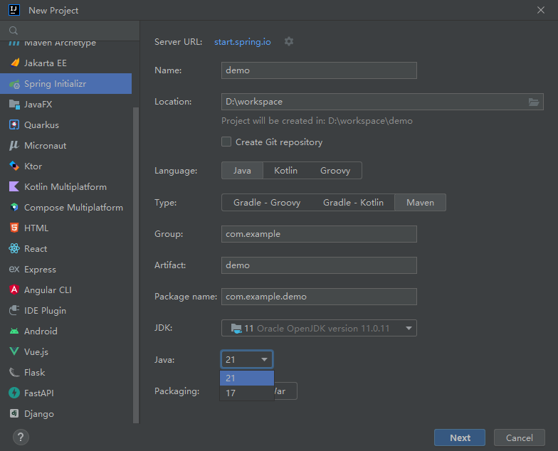
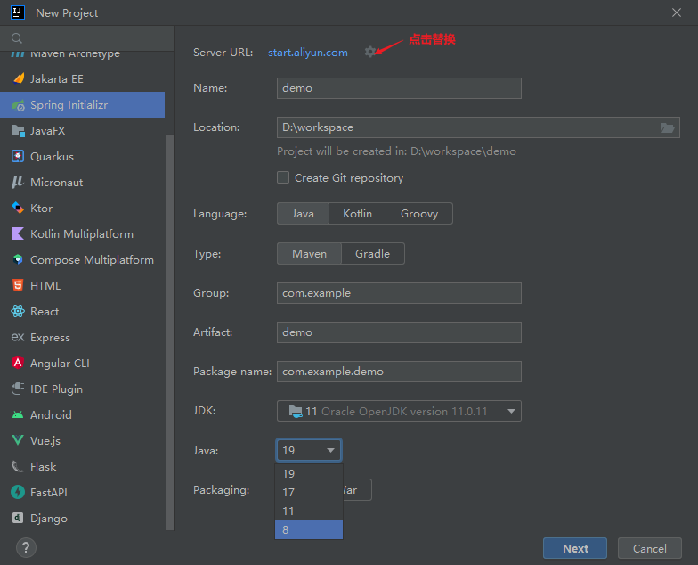
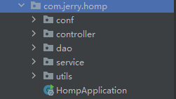

## HarmonyOS 实战小项目开发（一）

## 日常逼逼叨

在经过一周多的Harmonyos 开发基础知识的学习后，自己通过对于Harmonyos基础知识的学习之后，结合自己的一些想法，独自完成了利用Arkts布局的Harmonyos 项目，在此将整个过程与各位共享出来，如有一些错误，希望观众老爷们批评指正😃😃😃


## 项目简述

**练手项目名称**：个人**mbti性格测试**

**项目背景**：相信各位小伙伴都比较了解前段时间很火的性格测试，在经过比较多的（大概90多道题目吧）题目测试之后，会获取到对于自己性格的一些说明，但是比较烦的是，在你自己认认真真的答完90多道题目想要进行结果的查看，这个时候突然弹出收费....王德发😅，这还能给你收费了？

在经过这个痛苦的过程之后，自己在网络上收取了一些关于性格测试的题目，在理解了关于性格测试的原理之后，结合自己学习的前后端知识，自己制作了一个性格测评。

**性格测试原理及结果计算方法**

- 首先呢，性格测试的结果是由8项（**E、I、S、N、T、F、J、P**）（性格指标）组成的，性格测试过程中你会拿到28（98、或者更多）的性格测试题目，每道题目分值为一分且一般会有两个选项，每一个选项对应上述8个指标中的一个，不同题目不同选项对应的指标不一定一致。
- 比如有两道测试题，测试题1选项a对应指标E，选项b对应指标I，测试题2选项a对应指标J，选项b对应指标P。同时这些指标往往是成对出现的，比如**“E-I”、“S-N”、“T-F”**和**“J-P”**，这个叫做组别。
- 在玩家完成手头的题目作答之后呢，会得到一个由上述8项指标组成的序列，在该序列中，只需要在该序列中找到并比较四个组别的得分。每个组别中，获得较高分数的那个类型，就是你的性格类型倾向。例如：你的得分是：**E**（外向）12分，**I**（内向）9分，那你的类型倾向便是**E**（外向）了。
- 但是在序列中，可能存在某个组别中，个数一致的情况，同分处理规则为：
  假如E=I ------>  I
  假如S=N ------> N
  假如T=F ------>  F
  假如J=P ------> P

**项目简介**：采用前**后端分离**的设计，前端采用**Harmony os ArkTs** 声明式UI 设计，后端采用**Spring-Boot+mongodb**(当然感兴趣的也可以试试mysql等其他数据库) 

**主要能学到什么**：

- 对于Harmony os 的新手而言，通过这个项目，能够快速的帮你了解到以下知识点：

  - 基础的一些布局以及基础的一些组件使用

  - 页面跳转，传递参数

  - 网络请求

  - 父子组件传值

  - 打包安装

  - <暂时想不起来了，符号占位先>

- 对于后端的小伙伴们而言

  - spring-boot集成mongodb实现数据的增删改查
  - mongodb 的一些语句操作


那话不多说，我们马上开始~

## 后端搭建

### 数据库设计

- **数据库选择**
  
  - 首先数据库的选择方面呢，之前一直用的mysql，这次手头有一个mongodb,想着换换口味，就暂定将mongodb作为后端数据库使用，作为数据的存储。
  
- 数据结构梳理
  - 数据结构方面大概有两种数据需要我们进行存储
    - 第一个呢就是题目，作为一个个人的性格测试，当然是要存在题目这一个概念的
    
    - 其次呢就是测评结果对应的说明，这个也是比较重要的
    
      目前想到的也就这两个，不够的话，我们后期再加，或者有其他想法的小伙伴也可以联系我进行一些二次开发🤗🤗
  
- 数据表设计

  - 测试题目表（mbtiTopic）

    - | _id             | String | mongodb 对应的主键uuid |
      | --------------- | ------ | ---------------------- |
      | name            | String | 题干                   |
      | optionA         | String | 选项A                  |
      | optionB         | String | 选项B                  |
      | sequence_number | int    | 题目序号               |
      | valA            | String | 选项A所对应的意义      |
      | valB            | String | 选项B所对应的意义      |

  - 结果对照表

    - | _id             | String | mongodb 对应的主键uuid |
      | --------------- | ------ | ---------------------- |
      | ansCode         | String | 性格测试结果字符串     |
      | ansDisc         | String | 性格测试结果描述       |
      | ansName         | String | 性格测试结果名称       |
      | sequence_number | int    | 序号                   |


### Spring-Boot项目初始化

- 对于后端的搭建，是一个简单的Spring-Boot的项目，首先呢就是初始化一个Spring-Boot项目，经过一步一步的选择，我们便能得到一个什么都没有的Spring-Boot项目

  - **不过值得注意的是，如果你的idea在初始化Spring-Boot项目的时候，只能选择java版本为17和21，但是你想使用java8时，请按照如下步骤进行操作**

    

    - 我们只知道IDEA页面创建Spring项目，其实是访问spring initializr去创建项目。故我们可以通过阿里云国服去间接创建Spring项目。将https://start.spring.io/或者http://start.springboot.io/替换为 https://start.aliyun.com/

    

- 创建完成项目之后，需要在pom.xml中进行相关依赖的 引入(**按需导入**)

```xml
<dependencies>
		<!--mongodb-->
        <dependency>
            <groupId>org.springframework.boot</groupId>
            <artifactId>spring-boot-starter-data-mongodb</artifactId>
        </dependency>
        <!--springWeb-->
        <dependency>
            <groupId>org.springframework.boot</groupId>
            <artifactId>spring-boot-starter-web</artifactId>
        </dependency>
		<!--springdevtools-->
        <dependency>
            <groupId>org.springframework.boot</groupId>
            <artifactId>spring-boot-devtools</artifactId>
            <scope>runtime</scope>
            <optional>true</optional>
        </dependency>
    	<!--lombok-->
        <dependency>
            <groupId>org.projectlombok</groupId>
            <artifactId>lombok</artifactId>
            <optional>true</optional>
        </dependency>
    	<!--springtest 这个是初始化项目自带的-->
        <dependency>
            <groupId>org.springframework.boot</groupId>
            <artifactId>spring-boot-starter-test</artifactId>
            <scope>test</scope>
        </dependency>
        <!--fastjson -->
        <dependency>
            <groupId>com.alibaba</groupId>
            <artifactId>fastjson</artifactId>
            <version>1.2.48</version>
        </dependency>
        <!--测试类，可以不用引入-->
        <dependency>
            <groupId>junit</groupId>
            <artifactId>junit</artifactId>
            <scope>test</scope>
        </dependency>
		<!--测试用到的数据解析类，可以不用引入-->
        <dependency>
            <groupId>com.google.code.gson</groupId>
            <artifactId>gson</artifactId>
        </dependency>
    </dependencies>
```


### 后台项目代码编写

### 任务点分解

那作为一个数据的提供后台，需要完成以下几个功能：

- **对于题目的管理功能**（前面想着做一个相关题目的管理界面，就写了这部分接口，但是界面真的不是很想搭建，留给爱学习的小伙伴们或者后面有时间再说）**目前没啥用**
- **查询题目功能**
- **计算性格属性功能**

既然目标比较明确了，辣么问题也就好办了起来！

### Spring-Boot+mongodb CRUD

以第一点对于题目的管理功能为例子，简单讲述一下Spring-Boot集成mongodb 进行数据的CRUD

- 首先，进行spring-mongo的依赖导入，详情见上文pom.xml的依赖，按需引入即可
- 进行简单的项目目录创建，简单的对于项目目录进行如下梳理
  - /conf：存放一些配置文件
  - /controller： 存放接口
  - /dao：存放对应的实体类
  - /service：存放一些service类
  - /service/serviceImpl：存放具体的service的逻辑实现类
  - /utils：存放通常的工具类



- 进行application.yml的配置

  ```yaml
  spring:
    data:
      mongodb:
        # 主机地址
        host: 127.0.0.1
        # 数据库
        database: MBTI
        # mongodb端口
        port: 27017
    main:
      allow-circular-references: true
  server:
      port: 8899
  ```

- 题目实体类(Topic)

  ```java
  /***
   *性格测试题目类
   */
  @Document("mbtiTopic") //表名称
  @Data
  @NoArgsConstructor
  @AllArgsConstructor
  public class Topic implements Serializable {
  
  
      @Id  //主键
      private String id;
  
      @Field  
      private String name;
  
      @Field
      private String optionA;
  
      @Field
      private String optionB;
  
  
      @Indexed(unique = true) //唯一索引
      @Field("sequence_number")//对应mongo中的字段，如果不对应，需要进行标注
      private Integer sequenceNumber;
  
      @Field
      private String valA;
  
      @Field
      private String valB;
  }
  ```

- 接口实现

  - TopicService

  ```java
  public interface TopicService {
      //查找全部
      List<Topic> findAll();
  
      //按照id查询
      Topic findById(int sequenceNumber);
  
      //按照id 修改
      Topic updateById(Topic topic);
  
      //按照id删除
      boolean delById(int sequenceNumber);
  
      //插入
      boolean insertOne(Topic topic);
  
  }
  ```

  - TopicServiceImpl

  ```java
  @Service
  public class TopicServiceImpl implements TopicService {
  
  
      @Autowired
      private MongoTemplate mongoTemplate;
  
      //查全部
      @Override
      public List<Topic> findAll() {
          return mongoTemplate.findAll(Topic.class);
      }
  
      //查根据id查询
      @Override
      public Topic findById(int sequenceNumber) {
          Query query = new Query();
          query.addCriteria(Criteria.where("sequence_number").is(sequenceNumber));
          Topic one = mongoTemplate.findOne(query, Topic.class);
          return one;
      }
  
      //根据id更新
      @Override
      public Topic updateById(Topic topic) {
          Topic save = mongoTemplate.save(topic);
          return save;
      }
  	//根据id删除
      @Override
      public boolean delById(int sequenceNumber) {
          Query query = new Query();
          query.addCriteria(Criteria.where("sequence_number").is(sequenceNumber));
          DeleteResult remove = mongoTemplate.remove(query, Topic.class);
          if (remove.getDeletedCount() > 0) {
              return true;
          }
          return false;
      }
  
      //插入
      @Override
      public boolean insertOne(Topic topic) {
          Topic save = mongoTemplate.save(topic);
          if (save != null) {
              return true;
          }
          return false;
      }
   }
  ```

  - controller

  ```java
  @RestController
  @CrossOrigin
  @RequestMapping("/manage")
  public class manageController {
  
      @Autowired
      private TopicService topicService;
      JSONObject jsonObject = new JSONObject();
  
  	//查询全部
      @GetMapping("/getAll")
      public JSONObject getAll() {
          jsonObject.clear();
          jsonObject.put("status", 200);
          jsonObject.put("data", topicService.findAll());
          return jsonObject;
      }
  
      //按照id查询
      @GetMapping("/getById/{id}")
      public JSONObject findById(@PathVariable("id") int id) {
          jsonObject.clear();
          Topic one = topicService.findById(id);
          if (one != null) {
              jsonObject.put("status", 200);
              jsonObject.put("data", one);
          } else {
              jsonObject.put("status", 200);
              jsonObject.put("data", null);
          }
          return jsonObject;
      }
  
      //更新
      @PutMapping("/update")
      public JSONObject updateById(@RequestBody Topic topic) {
          jsonObject.clear();
          Topic one = topicService.updateById(topic);
          if (one != null) {
              jsonObject.put("status", 200);
              jsonObject.put("msg", "更新成功~");
          } else {
              jsonObject.put("status", 201);
              jsonObject.put("msg", "更新失败~");
          }
          return jsonObject;
      }
  
      //删除
      @GetMapping("/del/{id}")
      public JSONObject delById(@PathVariable("id") int id) {
          jsonObject.clear();
          boolean isDel = topicService.delById(id);
          if (isDel) {
              jsonObject.put("status", 200);
              jsonObject.put("msg", "删除成功~");
          } else {
              jsonObject.put("status", 201);
              jsonObject.put("msg", "删除失败~");
          }
          return jsonObject;
      }
  
  }
  ```

### mongodb分页查询功能实现

- serviceImpl

  ```java
  public static final int DEFAULT_CURR_PAGE = 1;//默认第一页
  public static final int DEFAULT_PAGE_SIZE = 1;//默认每页1条
  
  
  
  public List<Topic> getListWithCriteria(int page, int pageSize) {
          Query query = new Query();
  
          // 分页查询
          int Page = page < 0 ? PageParameter.DEFAULT_CURR_PAGE : page;
          int PageSize = pageSize < 0 ? PageParameter.DEFAULT_PAGE_SIZE : pageSize;
  
          //此处为第几页,从第几条开始查,公式和sql一样,根据业务自行设置
          query.skip((Page - 1) * PageSize);
          //每页条数
          query.limit(PageSize);
          //调用find(),查出符合条件的数据
          List<Topic> topics = mongoTemplate.find(query, Topic.class);
          return topics;
  
      }
  ```

- controller

  ```java
  //分页查询
  @GetMapping("/getByPage/{page},{size}")
      public Object getByPage(@PathVariable("page") int page, @PathVariable("size") int size) {
          jsonObject.clear();
          List<Topic> listWithCriteria = topicService.getListWithCriteria(page, size);
          int size1 = listWithCriteria.size();
          if (size1 > 0) {
              jsonObject.put("status", 200);
              jsonObject.put("data", listWithCriteria);
              jsonObject.put("endTag", false);
          } else {
              jsonObject.put("status", "201");
              jsonObject.put("data", null);
              jsonObject.put("endTag", true);
          }
          return jsonObject;
      }
  ```

### 计算性格属性功能实现

**思路**：用户在移动端答题完成后将所有已选择题目的性格指标拼接成一个指标字符串提交给后端，后端通过遍历这个字符串，找出各个指标的数量，对应四个性格组别**“E-I”、“S-N”、“T-F”**和**“J-P”** ，按照前面所写的评分标准进行性格测试的结果计算。计算完成之后，返回给移动端进行渲染展示

- serviceImpl

  ```java
  public AnsReturn calculateAns(String string) {
          StringBuffer stringBuffer = new StringBuffer(string);
          HashMap<Character, Integer> map = new HashMap<>();
  
          for (int i = 0; i < stringBuffer.length(); i++) {
              char a = stringBuffer.charAt(i);
              if (map.get(a) == null) {
                  map.put(a, 1);
              } else {
                  map.put(a, map.get(a) + 1);
              }
          }
          System.out.println(map.keySet());
          System.out.println(map.values());
  
          Integer e = (map.get('E') == null ? 0 : map.get('E'));
          Integer i = (map.get('I') == null ? 0 : map.get('I'));
          Integer s = (map.get('S') == null ? 0 : map.get('S'));
          Integer n = (map.get('N') == null ? 0 : map.get('N'));
          Integer t = (map.get('T') == null ? 0 : map.get('T'));
          Integer f = (map.get('F') == null ? 0 : map.get('F'));
          Integer j = (map.get('J') == null ? 0 : map.get('J'));
          Integer p = (map.get('P') == null ? 0 : map.get('P'));
  
  
          //计算比率
          DecimalFormat decimalFormat = new DecimalFormat("0.00");
          String eRate = decimalFormat.format(((double) e / stringBuffer.length()) * 100);
          String iRate = decimalFormat.format(((double) i / stringBuffer.length()) * 100);
          String sRate = decimalFormat.format(((double) s / stringBuffer.length()) * 100);
          String nRate = decimalFormat.format(((double) n / stringBuffer.length()) * 100);
          String tRate = decimalFormat.format(((double) t / stringBuffer.length()) * 100);
          String fRate = decimalFormat.format(((double) f / stringBuffer.length()) * 100);
          String jRate = decimalFormat.format(((double) j / stringBuffer.length()) * 100);
          String pRate = decimalFormat.format(((double) p / stringBuffer.length()) * 100);
  
          //拼接结果
          StringBuffer res = new StringBuffer();
          res = e > i ? res.append("E") : res.append('I');
          res = s > n ? res.append('S') : res.append('N');
          res = t > f ? res.append('T') : res.append('F');
          res = j > p ? res.append('J') : res.append('P');
  
  
          Query query = new Query();
          query.addCriteria(Criteria.where("ansCode").is(res.toString()));//从字典表中获取性格结果信息
          AnsBasic one = mongoTemplate.findOne(query, AnsBasic.class);
  
          AnsReturn ans = new AnsReturn(res.toString(), eRate, iRate, sRate, nRate, tRate, fRate, jRate, pRate, one.getName(), one.getDisc());
  
          return ans;
      }
  ```

- controller

  ```java
   @PostMapping("/submit")
      public JSONObject calculateAns(@RequestBody JSONObject object) {
          jsonObject.clear();
          String ans = object.getString("ans");
          AnsReturn ans1 = topicService.calculateAns(ans);
          if (ans1 != null) {
              jsonObject.put("status", 200);
              jsonObject.put("data", ans1);
          } else {
              jsonObject.put("status", 201);
              jsonObject.put("data", null);
          }
          return jsonObject;
  
      }
  ```

  至此简单的后端代码已经全部开发完成，提供给移动端访问的接口有：查询所有的题目，提交自己的结果等待返回性格测试结果
  


## 结语

关于项目介绍以及简单的端项目搭建就先简单的介绍到这里，有关移动端的界面部署等，我们下期再聊，如果觉得up所述对你的学习等有点帮助，请务必留下你们的一键三连，谢谢各位观众老爷了。🤗🤗

## INVITATION

主要是对于HarmonyOS 的移动端开发基础知识的巩固，所以整体结构等都比较简单，就当练手了吧，项目已经开源，有兴趣的小伙伴可以加入进行后续的开发.

后端：[homp🌐](https://gitee.com/jerrylau213/homp)

希望有兴趣的小伙伴加入一起，我们做大做强，再创辉煌😇😇😇
