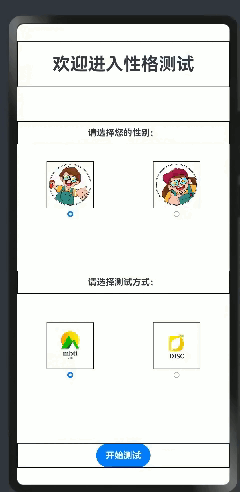
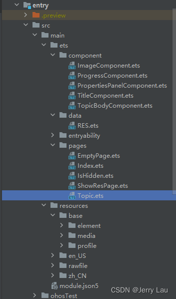
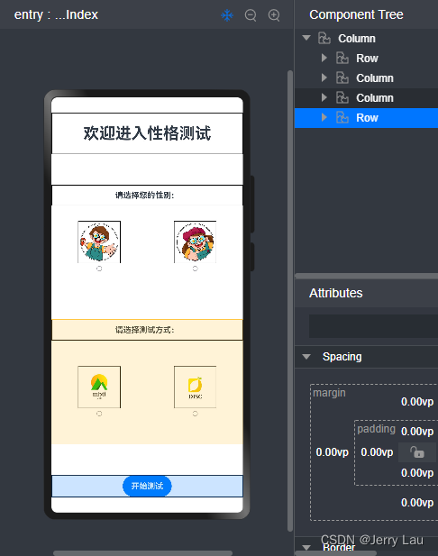
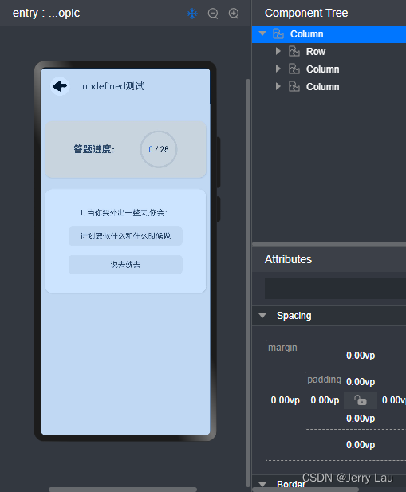
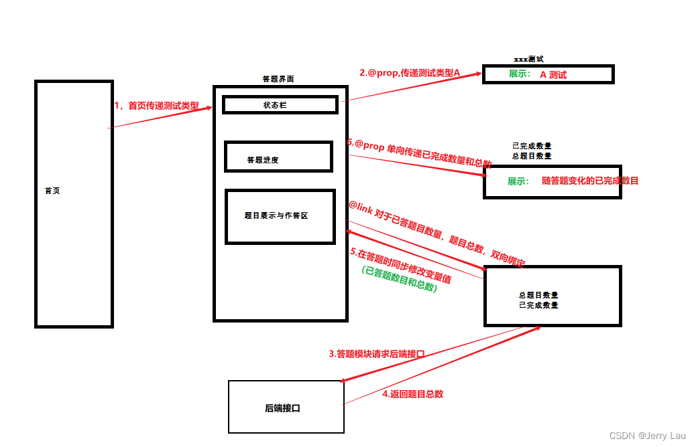
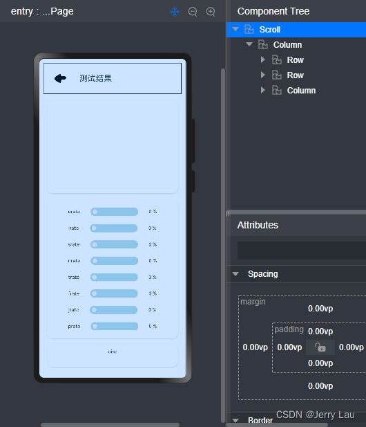
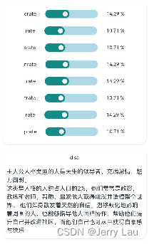

# HarmonyOS 实战小项目开发（二）

---

## 日常逼逼叨

在上期实战项目一中，已经对于练手项目的背景，后端搭建等做了一定的简述，那么本期将结合HarmonyOS 页面搭建个人性格测试的移动端。如有一些错误，希望观众老爷们批评指正😃😃😃

---

首先放一个图片，是整个的一个效果，至于页面布局配色方面的问题，希望大家勿喷，就我个人而言做不出具有美感的一些东西...,大家领会精神就行🤓🤓🤓。



## 移动端搭建

移动端的app主要包含四个界面：首页、答题、空界面，结果展示界面，整个界面做的比较简洁，但是有覆盖到前面所说的一些知识点

## 项目文件夹展示

那首先呢，还是老规矩，在这里带领大家了解一下我的项目路径




- /ets/component 主要是自定义的一些组件
  - ImageComponent  结果展示中图片组件
  - ProgressComponent   答题过程中进度条组件
  - PropertiesPanelComponent   结果展示属性面板组件
  - TitleComponent   各个页面菜单栏组件
  - TopicBodyComponent  题目展示答题区域组件
- /ets/data  自定义的实体类
  - RES 后端数据返回解析到的实体类
- /ets/pages 各个页面
  - EmptyPage   空界面
  - Index   主界面
  - IsHidden   自己之前测试的，在整个项目中没啥用途
  - ShowResPage   测试结果展示界面
  - Topic  题目展示界面
- /ets/resources  资源文件 配置文件等，在这里不在过多赘述

## 主界面搭建

主界面的搭建比较粗糙，页面中没有做一些组件化的东西，大致就是采用行，列布局进行的堆叠，通过图片与单选按钮进行逻辑处理，确定用户选择了什么性别以及什么样的测试方式



在整个页面组件最初声明变量，分别用来保存各个单选按钮是否被选中的状态，以及用户选择性别等的状态以性别这个列布局为例子，进行相关代码中的布局以及判定逻辑的展示

```typescript
  //最开始的变量声明
  @State ischeckedA: boolean = false //按钮A的初始化状态，默认不选中
  @State ischeckedB: boolean = false //按钮B的初始化状态，默认不选中
  @State ischeckedC: boolean = false //按钮C的初始化状态，默认不选中
  @State ischeckedD: boolean = false //按钮D的初始化状态，默认不选中
  @State sex: number = -1;  //性别 初始化状态为-1  0代表女性，1代表男性
  @State type: string = ''; //测试名称，初始化为空字符串，
```

```typescript
//性别选择模块
Column() {
        Row() {
          Column() {
            Text($r('app.string.EntryAbility_tips'))//请选择您的性别 提示
              .fontSize(15)
              .fontWeight(FontWeight.Bold)
          }
          .width('100%')
        }
        .border({ width: 1 })
        .height('5%')

        Row() {
          Column() {
            Image($r('app.media.sex_boy'))
              .width(this.imageWidth)
              .height(this.imageHeigt)
              .border({ width: 1 })
              .onClick(() => {
                this.ischeckedA = true;
                this.ischeckedB = false;
              })

            Radio({ value: 'sex_boy', group: 'sex' }).checked(this.ischeckedA)
              .height(10)
              .width(10)
              .onChange((isChecked: boolean) => {

                if (isChecked) {
                  console.log('boy')
                  this.sex = 1;
                }
              })
          }
          .width('50%')

          Column() {
            Image($r('app.media.sex_girl'))
              .border({ width: 1 })
              .width(this.imageHeigt)
              .height((this.imageHeigt))
              .onClick(() => {
                this.ischeckedA = false;
                this.ischeckedB = true;
              })
            Radio({ value: 'sex_girl', group: 'sex' }).checked(this.ischeckedB)
              .height(10)
              .width(10)
              .onChange((isChecked: boolean) => {
                if (isChecked) {
                  console.log('girl')
                  this.sex = 0;
                }
              })
          }
          .width('50%')
        }
        .height('20%')
      }
```

可以通过用户的选择进入不同的界面，不论男女，如果选择了mbti，则进入mbti测试界面，如果选择了disc，则跳转至空界面，当然用户如果不进行选择就开始测试，页面也会提醒用户进行选择。

```typescript
//开始测试按钮
Row() {
        Column() {
          Button('开始测试').type(ButtonType.Capsule)
            .fontSize(15)
            .fontWeight(FontWeight.Bold)
            .onClick(() => {

              if (this.sex === -1 || this.type === '') {
                AlertDialog.show(
                  {
                    title: '提示：',
                    message: '请选择性别或者测试方式！',
                    autoCancel: true,
                    alignment: DialogAlignment.Bottom,
                    offset: { dx: 0, dy: -200 },
                    gridCount: 4,
                  }
                )
              } else if (this.type === 'disc') {
                console.log(this.sex.toString())
                console.log(this.type.toString())
                // router.pushUrl({ url: 'pages/EmptyPage' })
                this.clickNext('pages/EmptyPage')
              }
              else {
                //携带参数 进行页面跳转
                console.log('' + this.sex)
                console.log('' + this.type)
                this.clickNext('pages/Topic')
              }
            })
        }
        .width('100%')
      }


//页面跳转自定义函数
clickNext(url:string) {
    router.pushUrl({
      url: url, //页面路由url
      params: {  //跳转时的携带的参数
        args1: this.sex,
        args2: this.type,
      }
    }, router.RouterMode.Single //单实例模式。
//如果目标页面的url在页面栈中已经存在同url页面，离栈顶最近的页面会被移动到栈顶，移动后的页面为新建页。
//如目标页面的url在页面栈中不存在同url页面，按标准模式跳转。
      )
  }
```

**特别注意：**如果想进行页面的跳转，你得让他知道你的基本路由，所以在添加新的界面的时候，一定要在 **src/main/resources/base/profile**下的**main_pages.json**进行路由配置，将新建界面的路由加进去才可以进行所谓的页面跳转

```json
//main_pages.json
{
  "src": [
    "pages/Index",
    "pages/EmptyPage",
    "pages/Topic",
    "pages/ShowResPage"
  ]
}
```

## 答题界面搭建

答题界面采用了组件的方式，将一个个模块按照组件的方式进行封装，然后进行调用，这样的话，在一定程度上可以精简页面，提高代码的复用性。相比index界面，答题界面的代码明显比较简洁，其中标题，进度条，题目答题区域都被封装成组件提取出去，在本页面使用时只需import进来，传入相关的参数即可。

```typescript
//Topic.ets
import { TitleComponent } from '../component/TitleComponent'
import { ProgressComponent } from '../component/ProgressComponent'
import { TopicBodyComponent } from '../component/TopicBodyComponent'
import router from '@ohos.router'

@Entry
@Component
struct Topic {
  @State paramsFromIndex: object = router.getParams()
  @State finishTopic: number = 0
  @State allTopic: number = 0

  build() {
      Column({ space: 20 }) {
        //标题
        TitleComponent({ title: this.paramsFromIndex?.['args2'] + "测试 " })
        //进度条
        ProgressComponent({ finishTopic: this.finishTopic, allTopic: this.allTopic })
        //答题界面
        TopicBodyComponent({finishTopic:$finishTopic,allTopic:$allTopic})
      }
      .width('100%')
      .height('100%')
      .backgroundColor("#f0f0f0")
  }
}
```

那么对于答题界面而言，topic.ets为父组件，标题，进度条，答题区域都为子组件。



进入该界面之后呢 首先得进行首页传值的接收，接收所传递的是哪种测试，同时将标题中界面展示字样进行修改。由于标题字样仅仅是做展示使用，也不会对这个值进行修改，父组件怎么传递，标题怎么渲染即可，所以父子组件之间传递值是属于单向传递，所以对于子组件中变量的监听与接收使用注解**@Prop**即可

```typescript
/***
 * 顶部状态栏
 */
import router from '@ohos.router'

@Component
export struct TitleComponent {
  @Prop title: string //父子传递为单向  父--->子

  build() {
    Row({ space: 22 }) {
      Image($r('app.media.left')).width(50).height(50).fillColor(Color.White)
        .margin({ left: 15 })
        .onClick(() => {
          router.back()
        })
      Text(this.title).fontSize(20)
    }.height("10%")
    .width('100%')
    .border({ width: 1 })

  }
}
```

在题目展示及答题区组件加载之前，先去加载后台数据，获取题目列表数据进行解析，获取到题目列表和题目总数。在答题的过程中，每当用户答完一道题后，已完成数目便会+1，由于父组件与该组件之间是**@Link**进行的双向数据传递，所以在该组件中获取到的数据，以及对于变量的修改，在父组件重视可以被感知的。

```typescript
//渲染之前进行网络请求
aboutToAppear(): void {
    //初始化数据
    let list = []

    //获取网络请求
    let httpRequest = http.createHttp();
    httpRequest.request("localhost:8899/homp/getAll", (err, data) => {
      if (!err) {
          //数据解析
        const response = data.result.toString();
        const res = JSON.parse(response).data

        for (let i = 0; i < res.length; i++) {
          let item = res[i];
          list.push({
            id: item.sequenceNumber,
            name: item.name,
            optionA: item.optionA,
            valA: item.valA,
            optionB: item.optionB,
            valB: item.valB,
          });
          // console.log(list[i].id)
        }
        this.allTopic = res.length //进行总题目数的修改
      } else {
        console.info('error:' + JSON.stringify(err));
      }
    });

    this.data = new MyDataSource(list)
  }

```

**特别注意**：由于网络请求这块不算做是默认存在的，得手动开启网络访问权限之后，才可以进行网络数据的获取，主要是对**src/main/**路径下的**module.json5**文件进行添加如下代码

```json
//网路权限
    "requestPermissions": [
      {
        "name": "ohos.permission.INTERNET",
        "usedScene": {
          "when": "always"
        }
      }
    ]
```

而在主体答题区呢 主要是用到了一个Swiper组件，类似于实现答一题进行自动翻页的效果，并将获取到的数据进行循环渲染。而在游标到达最后一题，并且已经答完时，跳转至结果展示界面等待后端计算返回性格测评的结果

```typescript
//答题区
Swiper(this.swiperController) {
        LazyForEach(this.data, (item: Topic) => {

          //嵌套组件 显示题目
          Column() {
            //题干
            Text(item.id + ". " + item.name)

            //选项A
            Button() {
              Row() {
                Text(item.optionA)
              }
            }
            .type(ButtonType.Normal)
            .optionStyle()
            .onClick(() => {
              let index = Number(item.id)
              this.finishTopic = index
              if (index === this.data.totalCount()) {
                //1-保存值
                this.res.push(item.valA)
                let ans = this.res.join('')
                console.log("ans:" + ans)
                //跳转界面（携带拼接好的选项字符串）
                router.replaceUrl({
                  url: 'pages/ShowResPage',
                  params: {
                    ans: ans,
                  }
                })

              } else {
                //1-保存值
                this.res.push(item.valA)
                //2-换到下一题
                this.swiperController.showNext()
              }

            })

            //选项B
            Button() {
              Row() {
                Text(item.optionB)
              }
            }.type(ButtonType.Normal)
            .optionStyle()
            .onClick(() => {
              let index = Number(item.id)
              this.finishTopic = index
              if (index === this.data.totalCount()) {
                //如果到最后一题了 显示提交按钮
                //1-保存值
                this.res.push(item.valB)
                let ans = this.res.join('')
                console.log("ans:" + ans)
                //跳转界面
                router.replaceUrl({
                  url: 'pages/ShowResPage',
                  params: {
                    ans: ans,
                  }
                })

              } else {
                //1-保存值
                this.res.push(item.valB)
                //2-换到下一题
                this.swiperController.showNext()
              }

            })

          }.width('90%')
          .height(180)
          .justifyContent(FlexAlign.SpaceEvenly)
        }, item => item)

      }
      .cardStyle() //自定义卡片样式
      .cachedCount(2)
      .index(0)
      .interval(4000)
      .indicator(false)
      .loop(false)
      .duration(1000)
      .itemSpace(0)
      .disableSwipe(true)
      .curve(Curve.Linear)
      .onChange((index: number) => {
        // console.info(index.toString() + this.res.join(''))
      })
```

答题进度中，由于父组件与展示题目子组件之间数据类似于双向绑定，在答题组件进行操作，答题后，会对已完成题目这个变量进行修改，而变量的变化能够被子组件感知并单向传递给进度组件，所以整个过程中，进度组件的显示也会随答题而发生变化

```typescript
/***
 * 题目列表中的进度模块
 */
@Component
export struct ProgressComponent {
  @Prop finishTopic: number
  @Prop allTopic: number

  build() {
    Column() {
      Row() {
        Text('答题进度：')
          .fontSize(20)
          .fontWeight(FontWeight.Bold)
        Stack() {//堆叠组件，将一个进度条和两个文本框进行堆叠，展示出比较好看的效果
          Progress(
            {
              value: this.finishTopic,
              total: this.allTopic,
              type: ProgressType.Ring

            }).width(80)
          Row() {
            Text(this.finishTopic.toString())
              .fontWeight(18)
              .fontColor("#36D")
            Text(' / ' + this.allTopic.toString())
              .fontWeight(18)
              .fontColor(Color.Black)
          }
        }

      }.cardStyle()
      .margin({ top: 15, left: 10, right: 10 })
      .justifyContent(FlexAlign.SpaceEvenly)
      .backgroundColor("#FAEBD7")

    }

  }
}
//自定义卡片样式
@Styles function cardStyle() {
  .width("95%")
  .padding(20)
  .backgroundColor(Color.White)
  .borderRadius(15)
  .shadow({ radius: 6, color: '#1F000000', offsetX: 2, offsetY: 4 })
}
```

那为了方便大家对于这块的理解，我做了如下的图示，方便大家理解父子组件传值在本案例中的应用



##### 结果展示界面搭建

结果展示界面也是将一些布局以组件的形式提取出去，方便以后的复用等，为了防止一些内容显示不下，整个页面是在一个滚动组件中进行的布局，滚动布局中还是包括三段，顶部提示栏，图片展示栏，以及底部的属性面板；



在进入该页面时，在界面加载渲染之前同样是接收答题界面传递过来的答题选项字符串，在接收到这个答题选项字符串后进行后端数据的请求，请求采用post请求，携带结果字符串，经过后端接口计算后返回测试结果以及性格属性值

```typescript
//post请求
aboutToAppear() {
    //获取网络请求  
    let httpRequest = http.createHttp();
    httpRequest.request("localhost:8899/homp/submit",
      {
        method: http.RequestMethod.POST,
        extraData: {
          "ans": this.paramsFromIndex?.['ans'],
        }
      },
      (err, data) => {
        if (!err) {
          const response = data.result.toString();
          const res = JSON.parse(response).data

          this.resShow = res;
          console.log("this.resShow.res:" + this.resShow.res)
          this.resStr = this.resShow.res
          console.log("resStr:" + this.resStr)

        }
      })
  }
```

这三部分分别对应着三个自定义组件，标题组件之前有提到过，在这不做过多的赘述，我们重点看一下其他两个组件

**图片组件**

在结果展示页面获取到后端返回的测试结果后，解析成为一个结果对象，获取到对象的性格简称，传递给图片组件，图片组件在拿到性格简称之后，通过字符串拼接获取到资源文件下的相关性格图片进行展示。同时还为图片添加了简单的动画效果

```typescript
@Component
  // @Entry
export struct ImageComponent {
  @State clicked: boolean = false;
  @Prop resStr: string

  // @State resStr: string = 'ENTP'

  build() {
    Row() {
      Column() {
        Image($rawfile(this.resStr + ".png"))
          .width("60%")
          .height("60%")
          .objectFit(ImageFit.Contain)
          // .border({ width: 1 })
          .rotate({
            x: 0,
            y: 1,
            z: 0,
            angle: this.clicked ? 360 : 0
          })
          .scale(
            this.clicked
              ? { x: 1.25, y: 1.25 }
              : { x: 1, y: 1 }
          )
          .opacity(this.clicked ? 0.6 : 1)
          .onClick(() => {
            this.clicked = !this.clicked;
          })
          .animation(
            {
              delay: 10,
              duration: 1000,
              iterations: 1,
              curve: Curve.Smooth,
              playMode: PlayMode.Normal
            }
          )
        Text(this.resStr)
          .fontSize(25)
          .width("90%")
          .height("20%")
          .decoration({
            type: TextDecorationType.Underline,
            color: Color.Orange
          })
          .fontWeight(FontWeight.Bold)
          .textAlign(TextAlign.Center)

      }.justifyContent(FlexAlign.SpaceEvenly)

    }
    .height("30%")
    .cardStyle()
    .margin({ top: 15 })
    // .border({ width: 1 })
    .alignItems(VerticalAlign.Center)
    .justifyContent(FlexAlign.Center)
  }
}
```

**属性面板组件**

在结果展示页面获取到后端返回的测试结果后，解析成为一个结果对象，将这个对象使用**@ObjectLink**整体作为数据进行传递到属性面板组件，在拿到这个对象后，获取相关的一些字段进行渲染即可

在进行一些占比数据的渲染时，使用到了HarmonyOs内置滑动条组件（ Slider），展示一些占比情况



```typescript
import { Res } from '../data/RES'
//属性面板
@Component
  // @Entry
export struct PropertiesPanelComponent {
  @ObjectLink resReturn: Res

  build() {
    Column() {
      Column() {
        Row() {
          Text('erate').fontSize(12)
          Slider({
            value: Number(this.resReturn.erate),
            min: 0,
            max: 40,
            style: SliderStyle.InSet
          }).panelStyle()

          Text(this.resReturn.erate + " %").fontSize(12)
        }.width('80%')
        .justifyContent(FlexAlign.SpaceAround)

        Row() {
          Text('irate').fontSize(12)
          Slider({
            value: Number(this.resReturn.irate),
            min: 0,
            max: 40,
            style: SliderStyle.InSet
          }).panelStyle()

          Text(this.resReturn.irate + " %").fontSize(12)
        }.width('80%')
        .justifyContent(FlexAlign.SpaceAround)

        Row() {
          Text('srate').fontSize(12)
          Slider({
            value: Number(this.resReturn.srate),
            min: 0,
            max: 40,
            style: SliderStyle.InSet
          }).panelStyle()

          Text(this.resReturn.srate + " %").fontSize(12)
        }.width('80%')
        .justifyContent(FlexAlign.SpaceAround)

        Row() {
          Text('nrate').fontSize(12)
          Slider({
            value: Number(this.resReturn.nrate),
            min: 0,
            max: 40,
            style: SliderStyle.InSet
          }).panelStyle()

          Text(this.resReturn.nrate + " %").fontSize(12)
        }.width('80%')
        .justifyContent(FlexAlign.SpaceAround)

        Row() {
          Text('trate').fontSize(12)
          Slider({
            value: Number(this.resReturn.trate),
            min: 0,
            max: 40,
            style: SliderStyle.InSet
          }).panelStyle()

          Text(this.resReturn.trate + " %").fontSize(12)
        }.width('80%')
        .justifyContent(FlexAlign.SpaceAround)

        Row() {
          Text('frate').fontSize(12)
          Slider({
            value: Number(this.resReturn.frate),
            min: 0,
            max: 40,
            style: SliderStyle.InSet
          }).panelStyle()

          Text(this.resReturn.frate + " %").fontSize(12)
        }.width('80%')
        .justifyContent(FlexAlign.SpaceAround)

        Row() {
          Text('jrate').fontSize(12)
          Slider({
            value: Number(this.resReturn.jrate),
            min: 0,
            max: 40,
            style: SliderStyle.InSet
          }).panelStyle()

          Text(this.resReturn.jrate + " %").fontSize(12)
        }.width('80%')
        .justifyContent(FlexAlign.SpaceAround)

        Row() {
          Text('prate').fontSize(12)
          Slider({
            value: Number(this.resReturn.prate),
            min: 0,
            max: 40,
            style: SliderStyle.InSet
          }).panelStyle()

          Text(this.resReturn.prate + " %").fontSize(12)
        }.width('80%')
        .justifyContent(FlexAlign.SpaceAround)
      }.cardStyle()
      .margin({ top: 15 })


      Column() {
        Text('disc').fontSize(12).margin({ bottom: 15 })
        Text(this.resReturn.disc)
          .fontSize(14)
          .maxLines(15)
          .lineHeight(20)
      }.cardStyle()
      .margin({ top: 15 })
      .justifyContent(FlexAlign.SpaceAround)
    }.width("100%")
    .height("80%")
    .alignItems(HorizontalAlign.Center)
  }
}

@Extend(Slider) function panelStyle() {	//自定义滑动条样式
  .width("50%")
  .blockColor('#ffefeff5')
  .trackColor('#ADD8E6')
  .selectedColor('#ff168a86')
  .showTips(true)
  .enabled(false)
}
```


## 总结

那到这里呢，移动端的一部分功能就搭建完成了，个人在页面的布局，配色上比较随便，做的也比较简单，后续有时间可以在进行细化吧；

对于mbti测试呢现在就告一段落，相信认真看的小伙伴们一定记得还有一个disc测评没有做，其逻辑等应该和mbti大同小异，有兴趣的小伙伴可以加入进来，对这个项目进行优化升级等。

---

主要是对于HarmonyOS 的移动端开发基础知识的巩固，所以整体结构等都比较简单，就当练手了吧，项目已经上传至gitee，并且全部开源，有兴趣的小伙伴可以加入进行后续的开发

前端：[mtbiTest🌐](https://gitee.com/jerrylau213/mbti-test)

后端：[homp🌐](https://gitee.com/jerrylau213/homp)

希望有兴趣的小伙伴加入一起，我们做大做强，再创辉煌😇😇😇

