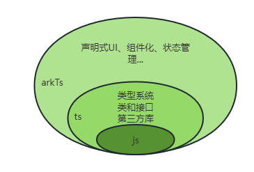

# HarmonyOS 开发入门（一）

##日常逼逼叨

因为本人之前做过一些Android相关的程序开发，对移动端的开发兴趣比较浓厚，近期也了解到了一些关于华为HarmonyOS 4.0 的事件热点，结合黑马相关教学视频以及一些相关的技术博客，对HarmonyOS开发做一个知识总结，有任何说的不合理的地方，希望各位看官老爷批评指正🤣🤣

---

## 一 、开发语言（ArkTS）

### ArkTS简介

ArkTS是HarmonyOS优选的主力应用开发语言。它在TypeScript（简称TS）的基础上，匹配了鸿蒙的ArkUI框架，扩展了声明式UI、状态管理等相应的能力，让开发者以更简洁、更自然的方式开发跨端应用。了解ArkTS之前，我们需要先了解下ArkTS、TypeScript和JavaScript之间的关系。

- JavaScript是一种属于网络的高级脚本语言，已经被广泛用于Web应用开发，常用来为网页添加各式各样的动态功能，为用户提供更流畅美观的浏览效果。
- TypeScript 是 JavaScript 的一个超集，它扩展了 JavaScript 的语法，通过在JavaScript的基础上添加静态类型定义构建而成，是一个开源的编程语言。
- ArkTS兼容TypeScript语言，拓展了声明式UI、状态管理、并发任务等能力，可以认为是TypeScript的超集。

由此可知，TypeScript是JavaScript的超集，ArkTS则是TypeScript的超集，他们的关系如下图所示。





### ArkTS，TS语法简介

下述所有代码均可以在在线[Ts playground](https://www.typescriptlang.org/play?#code/PTAEHUFMBsGMHsC2lQBd5oBYoCoE8AHSAZVgCcBLA1UABWgEM8BzM+AVwDsATAGiwoBnUENANQAd0gAjQRVSQAUCEmYKsTKGYUAbpGF4OY0BoadYKdJMoL+gzAzIoz3UNEiPOofEVKVqAHSKymAAmkYI7NCuqGqcANag8ABmIjQUXrFOKBJMggBcISGgoAC0oACCbvCwDKgU8JkY7p7ehCTkVDQS2E6gnPCxGcwmZqDSTgzxxWWVoASMFmgYkAAeRJTInN3ymj4d-jSCeNsMq-wuoPaOltigAKoASgAywhK7SbGQZIIz5VWCFzSeCrZagNYbChbHaxUDcCjJZLfSDbExIAgUdxkUBIursJzCFJtXydajBBCcQQ0MwAUVWDEQC0gADVHBQGNJ3KAALygABEAAkYNAMOB4GRonzFBTBPB3AERcwABS0+mM9ysygc9wASmCKhwzQ8ZC8iHFzmB7BoXzcZmY7AYzEg-Fg0HUiQ58D0Ii8fLpDKZgj5SWxfPADlQAHJhAA5SASPlBFQAeS+ZHegmdWkgR1QjgUrmkeFATjNOmGWH0KAQiGhwkuNok4uiIgMHGxCyYrA4PCCJSAA) 尝试运行

1. 初始化变量

   ```typescript
   //确定数据类型
   let msg: string ='hello' //string
   let i: number =22		//number
   let m: boolean =true	//boolean
   //any 不确定数据类型:ts不会进行数据类型检查
   let msg: any ='hello'
   msg=20
   //union 联合类型 指定多种数据类型中的一种
   let msg: string|number|boolean ='hello'
   msg=20
   //对象
   let person ={'name':'tom','age':18}
   console.log(person.name)
   console.log(person['age'])
   ```


2. 条件控制

   ```typescript
   let i: number = 15
   
   //判定是不是偶数
   if(i%2===0){
       console.log(i+'是偶数')
   }else{
       console.log(i+'是奇数')
   }
   
   
   let i: number = 0
   if(i){
       console.log(i)
   }else{
       console.log('---')
   }
   ```

   > Ts ==  与  ===
   >
   > > - 对于String, number这些基础类型，`==`操作符会先把两边的变量进行类型强制转换成相同的类型再比较是否相等；`===`操作符则不会进行类型转换，而是直接进行比较。
   > > - 对于array, object这些高级类型，`==`和 `===`是没有区别的，因为它们比较的是 “指针地址” 。
   > > - 对于基础类型和高级类型，`==` 和 `===`是有区别的；==操作符会先把高级类型转换为基础类型之后，进行值的比较；`===`操作符则不会进行转换，类型不同，直接返回false
   > >
   > > 也就是说，`==`操作符只要求比较两个变量的值是否相等，`===`操作符则是要求两个变量的值和类型都要相同；类似地，`!=`操作符会去做类型强制转换，`!==`操作符则不会转换类型。
   >
   > Ts  空字符串，数字0，null，undefined,都被认定为 false,其他值都为true

3. 循环

   ```typescript
   //与其他语言循环基本类似
   let i: number=10
   for(let m=0;m<i;m++){
        console.log(m)
   }
   
   //数组
   let pets: string[] =['cat','dog','duck']
   
   //in  遍历得到的是数组的index
   let pets: string[] =['cat','dog','duck']
   for(const one in pets){
       console.log(one)
   }
   
   //of 遍历得到的是数组的元素
   for(const one of pets){
       console.log(one)
   }
   ```

4. 函数

   ```typescript
   //无返回值
   function start(name: string): void{
   	console.log(name+' hello')
   }
   start('jerry')
   
   //有返回值
   function sum(a: number,b: number): number{
   	return a+b;
   }
   let res=sum(1,2)
   console.log('1+2='+res)
   
   //可变参数
   function start(name?: string): void {
       if(name){
           name=name;
       }else{
           name='访客';
       }
      
       console.log(name+'登录')
   }
   
   start()
   start('jerry')
   ```


5. 接口和类

   ```typescript
   // 定义枚举
   enum Msg{
        HI = 'Hi',
       HELLO = 'Hello'
   }
   //定义接口，抽象方法接收枚举参数
   interface A {say(msg: Msg): void }
   //实现接口
   class B implements A {
       say(msg: Msg): void {
           console.log(msg + ', I am B')
       }
   }
   // 初始化对象
   let a: A = new B()// 调用方法，传递枚举参数
   a.say(Msg.HI)
   ```

   ```typescript
   //类
   // 定义矩形类
   class Rectangle {
       //成员变量
       private width: number
       private length: number
   
       // 构造函数
       constructor(width: number, length: number) {
           this.width = width
           this.length = length
       }
       // 成员方法
       public area(): number {
           return this.width * this.length
       }
   }
   //定义正方形
   class Square extends Rectangle {
       constructor(side: number) {
           super(side, side)
       } //调用父类构造
   }
   let s = new Square(10)
   console.log('正方形面积为:' + s.area())
   ```


6. 模块抽取

   > 应用复杂时，我们可以把通用功能抽取到单独的ts文件中，每个文件都是一个模块 (module)。
   > 模块可以相互加载，提高代码复用性。

   ```typescript
   rectangle.ts
   //定义矩形类，并通过export导出
   export class Rectangle {//成员变量
       public width: number
       public length: number
       //构造函数
       constructor(width: number, length: number) {
           this.width = width
           this.length = length
       }
   }
   
   //定义工具方法，求矩形面积，并通过export导出
   export function area(rec: Rectangle): number {
       return rec.width * rec.length
   }
   
   
   index.ts
   //通过import语法导入，from后面写文件的地址
   import { Rectangle, area } from '../rectangle
   //创建Rectangle对象
   let r = new Rectangle(10, 20)
   //调用area万法
   console.log('面积为: ' + area(r))
   
   ```


   ---

第一期就先说这么多，还在努力加更中...😜😜😜😜

---

###### 特别鸣谢

1. 黑马程序员 HarmonyOS开发教程
2. [鸿蒙开发之ArkTS基础知识]( [鸿蒙开发之ArkTS基础知识_鸿蒙开发语言_xiangzhihong8的博客-CSDN博客](https://blog.csdn.net/xiangzhihong8/article/details/131845607) )