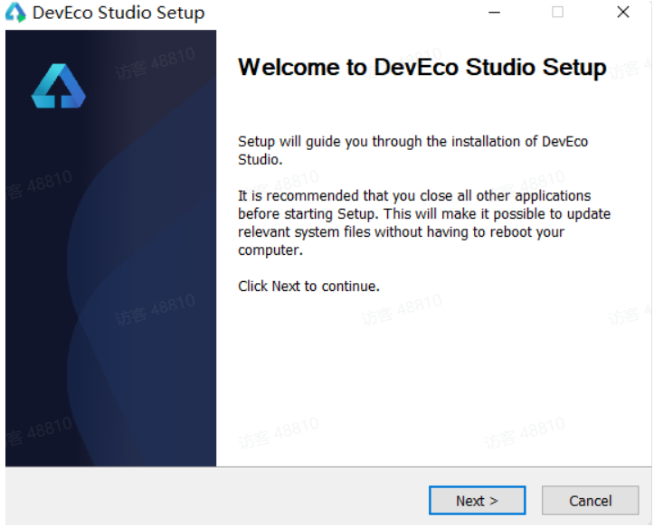

# HarmonyOS 开发入门（二）

###### 日常逼逼叨

在``HarmonyOS 开发入门（一）``中我们描述了 HarmonyOS 开发的语言ArKTs以及Ts简单的入门级语法操作，接下来我们进入第二部分HarmonyOS开发编辑器以及helloWorld项目创建，有任何说的不合理的地方，希望各位看官老爷批评指正🤣🤣

---

##### 一 、开发环境搭建

1. **下载开发编辑器**

   - [官方下载页面✅]( https://developer.harmonyos.com/cn/develop/deveco-studio/#download)
   - 根据自己的操作系统版本进行选择下载

2. **安装dev**

   - 首先下载下来是一个名为`devecostudio-windows-3.1.0.501.zip`的压缩包(由于可能会进行不定时的更新，下载后的版本序列号可能存在一定的差异)，解压后进行安装.

   

   - 一直点击下一步，直到一下界面，为了免去手动进行配置环境变量，直接勾选

     add bin to path ，然后继续 next

     

- 安装结束之后，选择重启计算机

- 重启之后就会看到桌面快捷方式，该程序为开发工具。

3. **进行依赖添加以及所需要的SDK下载**

   - 双击打开编辑器，首次进入欢迎界面，在这里需要同意一些用户条例。

   

- 一般情况下不进行默认编辑器配置的导入，直接选择**do not  import**
- 选择要安装的**Node.js**和**Ohpm**位置，其中ohpm是Open Harmony Package Management的缩写，也就是类似npm的包管理工具。这里有几点注意事项：
   - 如果电脑上已经有Node.js，但是版本不一致，建议选择让工具重新安装
   - 如果电脑上已经有Node.js，并且版本一致，可以选择Local，指定node目录即可
   - 如果电脑上对Node.js做了一些特殊的options配置，建议先移除
   - 配置目录中不要出现中文、特殊字符，建议用默认路径

- 在**SDK Setup**界面，单击***文件夹***按钮，设置HarmonyOS SDK存储路径，单击**Next**进入下一步。

- 在弹出的SDK下载信息页面，单击**Next**，并在弹出的**License Agreement**窗口，阅读License协议，需同意License协议后，单击**Next**。

- 确认设置项的信息，点击**Next**开始安装，等待Node.js、ohpm和SDK下载完成后，单击**Finish**，界面会进入到DevEco Studio欢迎页。

**至此，编辑器安装成功，开发环境搭建完成，如果在您搭建的过程中，还存在一些其他的问题，可以参考官网**

[HarmonyOS官网环境搭建配置🌍](https://developer.harmonyos.com/cn/docs/documentation/doc-guides-V3/environment_config-0000001052902427-V3#section551917522319)

##### 二、HelloWorld项目搭建

1. 打开Dev编辑器，选择创建一个新的project

   

2. 选择默认的ability，点击next

3. 输入包名称等一些基础的信息之后，再点击finish

   

4. 等待项目构建完成，大致代码以及编辑器大致如下图所示

   

5. 添加模拟器以及一些模拟器的配置

    

    

    

    

6. 运行helloWorld 程序

   

**至此 开发环境搭建以及运行hello world 结束**

**一些简单的组件讲解，up 会尽快更新的~** 🤣🤣🤣🤣